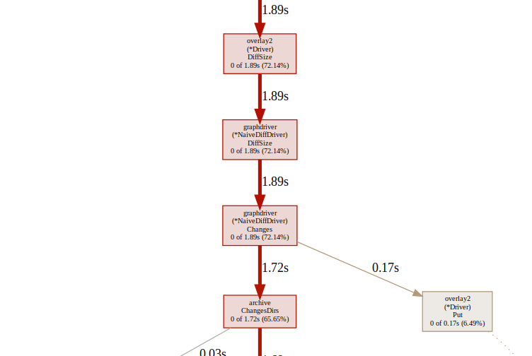
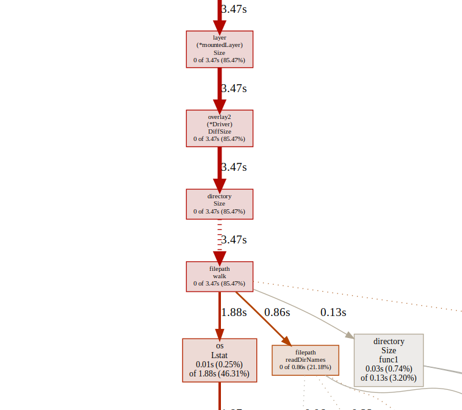

# Docker ps 高延迟问题分析


* 客户： 算能
* 问题单：http://172.17.110.25/zentao/story-view-1588.html?tid=xnrss6m8

## 背景

算能客户在 3C6000 平台上使用容器化部署大模型推理系统。曾经反馈了 docker 卡死问题已解决，此次客户在软件中使用了 `docker ps -a --format '{json .}'` 来获取容器信息，发现该命令执行超时，导致软件运行失败。

## 排查

### 确认问题（与其他架构对比）

| loongarch64 | x86   | aarch64 |
| ----------- | ----- | ------- |
| 0.221       | 0.012 | 0.017   |

使用 time \$cmd 分析执行时间，可以看到 aarch64 与 x86 基本一致，在 10ms 之间，而 la 架构耗时 200 ms，明显异常。

### 缩小问题范围

该命令的输出结果如下，用于获取容器的信息，猜测是否是获取某一个数据过于耗时导致的

```
$ docker ps -a -s --format '{{json .}}' | jq
{
  "Command": "\"/bin/bash\"",
  "CreatedAt": "2025-07-11 16:49:07 +0800 CST",
  "ID": "d20d601ed1e5",
  "Image": "lcr.loongnix.cn/debian:trixie",
  "Labels": "maintiner=znley<shanjiantao@loongson.cn>",
  "LocalVolumes": "0",
  "Mounts": "",
  "Names": "test",
  "Networks": "bridge",
  "Ports": "",
  "RunningFor": "4 days ago",
  "Size": "37.9MB (virtual 180MB)",
  "State": "running",
  "Status": "Up 3 hours"
}
```

使用查询条件进行过滤，发现

仅查询 ID `time docker ps -a -s --format '{{json .ID}}'`

| loongarch64 | x86   |
| ----------- | ----- |
| 0.009       | 0.013 |

仅查询 Size `time docker ps -a -s --format '{{json .Size}}`

| loongarch64 | x86   |
| ----------- | ----- |
| 0.216       | 0.012 |

由此可以看到，在 la 上查询容器的 `.Size` 属性占据了绝大多数时间，由此问题就缩小到 .Size 耗时，后续的测试命令固定为 `docker ps -a -s --format '{{json .Size}}`

### 通过 strace 分析异常耗时

通过 `strace $cmd` 来检查是否存在异常的系统调用

```
sudo strace -tt -f -T docker ps -a -s --filter 'id=55636bf806d6' --format '{{json .ID}}'

[pid  4510] 14:17:06.607554 <... epoll_pwait resumed>[{events=EPOLLOUT, data={u32=3461873667, u64=9223354624224264195}}], 128, 1998, NULL, 0) = 1 <0.000028>
[pid  4517] 14:17:06.607571 futex(0xc000620148, FUTEX_WAIT_PRIVATE, 0, NULL <unfinished ...>
[pid  4514] 14:17:06.607586 futex(0xc0000a0148, FUTEX_WAIT_PRIVATE, 0, NULL <unfinished ...>
[pid  4510] 14:17:06.607603 epoll_pwait(4,  <unfinished ...>
[pid  4512] 14:17:06.607613 futex(0xc000070548, FUTEX_WAIT_PRIVATE, 0, NULL <unfinished ...>
[pid  4510] 14:17:06.607628 <... epoll_pwait resumed>[], 128, 0, NULL, 0) = 0 <0.000015>
[pid  4510] 14:17:06.607653 epoll_pwait(4, [{events=EPOLLIN|EPOLLOUT, data={u32=3461873667, u64=9223354624224264195}}], 128, -1, NULL, 0) = 1 <0.000026>
[pid  4510] 14:17:06.607716 read(3, "HTTP/1.1 200 OK\r\nApi-Version: 1."..., 4096) = 203 <0.000012>
[pid  4510] 14:17:06.607779 futex(0xc000070548, FUTEX_WAKE_PRIVATE, 1) = 1 <0.000011>
[pid  4512] 14:17:06.607806 <... futex resumed>) = 0 <0.000183>
[pid  4510] 14:17:06.607826 read(3,  <unfinished ...>
[pid  4512] 14:17:06.607837 epoll_pwait(4,  <unfinished ...>
[pid  4510] 14:17:06.607849 <... read resumed>0xc000027000, 4096) = -1 EAGAIN (Resource temporarily unavailable) <0.000011>
[pid  4512] 14:17:06.607861 <... epoll_pwait resumed>[], 128, 0, NULL, 0) = 0 <0.000017>
[pid  4512] 14:17:06.607883 epoll_pwait(4,  <unfinished ...>
```

对输出进行清洗，仅显示系统调用耗时 `cat docker.strace | grep -E '<0.[0-9]+>' |  awk -F '[<>]' '{print $(NF-1)}'`

```
0.000010
0.000008
0.000012
0.000224
0.000214
0.000104
0.000013
0.000119
0.000035
0.000013
0.000027
0.185262
0.000012
```

看到某一个系统调用耗时明显异常，定位到这个系统调用是 `pwait_epoll`。

### 判断 c/s 可能出现问题的地方

联想到 docker 命令的执行逻辑，docker 分为两部分，docker cli 和 dockred 守护进程。一般的 docker 命令指的是 docker cli，通过 cli，将 http 数据通过 sock 发送到 dockerd，dockerd 进行处理，所以这里的 epoll\_pwait 耗时极有可能是 http 等待耗时，而真正处理是在 dockerd 侧。为了应证这个想法，查阅 docker cli 源码。

```
func runPS(dockerCli command.Cli, options psOptions) error {
  
	...

        tasks, err := client.TaskList(ctx, types.TaskListOptions{Filters: filter})
        if err != nil {
                return err
        }
        ...
}
```

```
func (cli *Client) TaskList(ctx context.Context, options types.TaskListOptions) ([]swarm.Task, error) {
        query := url.Values{}

	...
        resp, err := cli.get(ctx, "/tasks", query, nil)
	...
}
```

```
// get sends an http request to the docker API using the method GET with a specific Go context.
func (cli *Client) get(ctx context.Context, path string, query url.Values, headers map[string][]string) (serverResponse, error) {
        return cli.sendRequest(ctx, http.MethodGet, path, query, nil, headers)
}
```

运行逻辑和了解的 docker 运行原理相同，客户端 cli 通过 http 将处理任务发送给服务端，客户端处理在处理 Size 和没有 Size 的流程是相同的，不存在瓶颈，那么异常耗时应该发生在服务端 dockerd。

### 使用 strace 分析服务端系统调用

由于 docker 的 c/s 架构，需要启用两个窗口，一个窗口使用 strace 追踪系统调用，另一个窗口执行 `docker ps` 进行触发。

* `strace -f -tt -T -p $(pgrep docker)`
* `docker ps -a -s --format '{{json .Size}}`

发现 la 和 x86 上 strace 输出的条目存在巨大差异

| la    | x86 |
| ----- | --- |
| 52076 | 244 |

仔细查看了一下 strace 的输出，发现其对容器中的每个文件都进行了 statx 操作，所以产生了大量的系统调用。而 x86 则没有对单个文件的 statx 操作。

**也就是说，在获取容器 size 时，x86 和 la 的处理逻辑不同**

### 使用 pprof 分析热点函数

分析这些 statx 都是谁产生的，可以借助 go pprof 性能分析工具，由于 dockerd 是监听在 sock 上，为了方便 pprof 工具使用，将 8080 tcp 端口转发到 sock 上。

```
socat -d -d TCP-LISTEN:8080,fork,bind=0.0.0.0 UNIX:/var/run/docker.sock
```

还是两个窗口，一个启用一个 go pprof 捕获数据，另一个进行触发

* `go tool pprof http://nla:8080/debug/pprof/profile?seconds=10`
* `docker ps -a -s --format '{{json .Size}}`

la 和 x86 的热点函数流程在 Overlay2 DiffSize 处不一致。






### 问题定位

定位源码，la 走了 `useNaiveDiff` 而 x86 走了 `directory.Size`

```
func (d *Driver) DiffSize(id, parent string) (size int64, err error) {
        if useNaiveDiff(d.home) || !d.isParent(id, parent) {
                return d.naiveDiff.DiffSize(id, parent)
        }
        return directory.Size(context.TODO(), d.getDiffPath(id))
}

func useNaiveDiff(home string) bool {
        useNaiveDiffLock.Do(func() {
                if err := doesSupportNativeDiff(home); err != nil {
                        logger.Warnf("Not using native diff for overlay2, this may cause degraded performance for building images: %v", err)
                        useNaiveDiffOnly = true
                }
        })
        return useNaiveDiffOnly
}

// doesSupportNativeDiff checks whether the filesystem has a bug
// which copies up the opaque flag when copying up an opaque
// directory or the kernel enable CONFIG_OVERLAY_FS_REDIRECT_DIR.
// When these exist naive diff should be used.
//
// When running in a user namespace, returns errRunningInUserNS
// immediately.
func doesSupportNativeDiff(d string) error {

        if string(xattrRedirect) == "d1" {
                return errors.New("kernel has CONFIG_OVERLAY_FS_REDIRECT_DIR enabled")
        }
	...
```

这是一个单例函数，从注释函数可以看到，函数会检查文件系统是否有一些bug，或者内核是否启用了 CONFIG\_OVERLAY\_FS\_REDIRECT\_DIR，任意一点满足就需要使用 NativeDiff 来保证正确性。

排查内核关于 overlay2 文件系统的配置

|                                               | la | x86 |
| --------------------------------------------- | -- | --- |
| CONFIG\_OVERLAY\_FS                           | y  | y   |
| CONFIG\_OVERLAY\_FS\_REDIRECT\_DIR            | y  | n   |
| CONFIG\_OF\_OVERLAY                           | n  | y   |
| CONFIG\_OVERLAY\_FS\_REDIRECT\_ALWAYS\_FOLLOW | y  | n   |
| CONFIG\_OVERLAY\_FS\_INDEX                    | y  | n   |
| CONFIG\_OVERLAY\_FS\_XINO\_AUTO=              | y  | n   |
| CONFIG\_OVERLAY\_FS\_METACOPY                 | y  | n   |

在 overlay 方面，la 的配置和 x86 几乎相反，而 x86 和 arm64 保持一致。

### 问题修复

重新配置并编译内核，问题解决，docker 运行正常

| loongarch64 | x86   |
| ----------- | ----- |
| 0.009       | 0.011 |

## 总结

* 理解应用程序结构有助于避免无效的 debug
* 架构相关的问题，与 x86 比对，strace 往往可以输出有效的信息辅助判断，比如系统调用频率和时间
* golang 应用程序使用 go pprof 能直观显示热点函数调用
* 对于 sock 监听项目，可以使用 socat 进行端口转发来使用 pprof
* 架构相关的内核配置会影响到架构无关应用例如 docker 的性能，如何界定架构相关和架构无关工作

