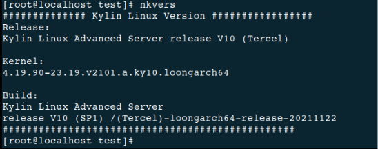
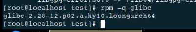
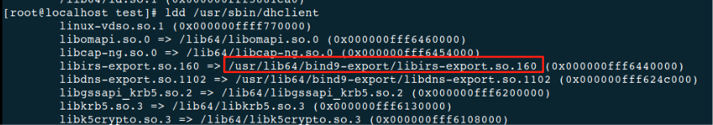
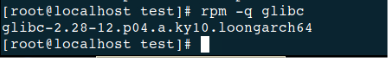
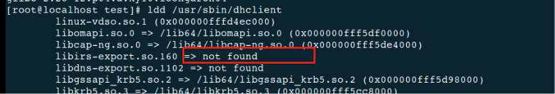
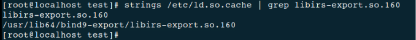
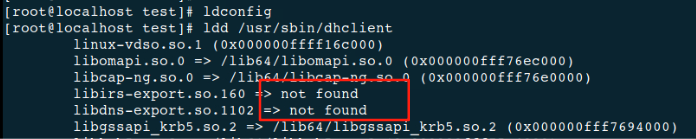
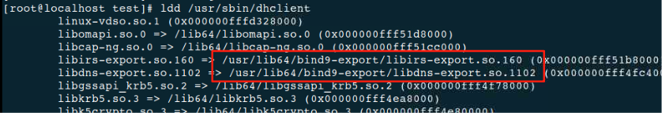
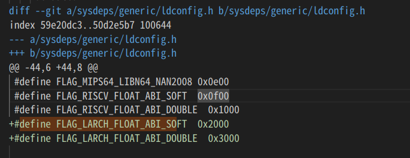
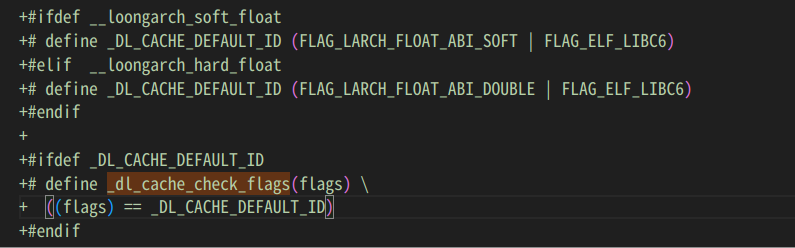

# glibc 2.28增加LARCH\_FLOAT\_ABI后ldd报错

# 一、问题现象

&#x20;   

## 1. 系统版本

&#x20;   

 

&#x20;   



## 2. 涉及组件版本

&#x20;   

glibc-2.28-12.p02.a.ky10.loongarch64

glibc-2.28-12.p03.a.ky10.loongarch64

glibc-2.28-12.p04.a.ky10.loongarch64

## 3. 复现步骤 

（1）glibc初始版本为glibc-2.28-12.p02.a.ky10.loongarch64；

&#x20;   

 



（2）ldd /usr/sbin/dhclient，动态库正常；

&#x20;   

 



（3）将glibc升级到glibc-2.28-12.p04.a.ky10.loongarch64；

&#x20;   

 



（4）ldd /usr/sbin/dhclient，再次查看，动态库找不到

&#x20;   

 



 

# 二、问题分析

&#x20;   

## 1. glibc升级后，查看显示找不到的动态库，实际是存在的

&#x20;   

 


 

## 2. 查看/etc/ld.so.cache缓存，也是存在的

&#x20;   

 



 

## 3. 重新执行ldconfig，依然找不到

&#x20;   

 




 

## 4. 删除缓存后，重新ldconfig生成，可以找到了

&#x20;   

\# rm -f /etc/ld.so.cache /var/cache/ldconfig/\*

\# ldconfig 

 



 

## 5. 目前仅在低版本（p02、p03）升级到p04及以上的时候出现这个问题；p02升级到p03没有这个问题；p04往上升也没有这个问题；


 

## 6. 分析p04的补丁，是为了解决https://pm.kylin.com/bug-view-124756.html问题添加的，进一步查看补丁内容

&#x20;   

 

## 7. 该补丁主要涉及LoongArch架构的浮点ABI标志处理，新增了以下两个标志

&#x20;   

 



初步分析，可能是下列代码导致的该问题

 



在\_dl\_cache\_check\_flags中，动态链接器会检查缓存中的库标志（flags）是否与当前系统的默认标志（\_DL\_CACHE\_DEFAULT\_ID）匹配，如果不匹配，动态链接器将认为该库不兼容，从而拒绝加载。

回到问题现象，glibc升级后，/etc/ld.so.cache缓存中的库仍保留旧标志，动态链接器会因标志不匹配而忽略这些缓存的库，导致库加载失败。而当删除缓存并重新生成后，新的缓存中就有新的标志了，就可以识别并正确加载。


经过分析，龙芯提供的glibc 2.28代码不包含此处修改，麒麟自己从开源社区获取代码后进行修改，修改目的是为了保证bcc能够正常使用。 

# 三、影响范围

&#x20;   

该问题的影响范围是：

glibc-2.28-12.p02.a.ky10.loongarch64、 glibc-2.28-12.p03.a.ky10.loongarch64

以上两个软件包升级到glibc-2.28-12.p04.a.ky10.loongarch6及以上版本后，/etc/ld.so.conf.d目录下的配置文件中设置的动态库无法找到。

 

# 四、解决方案

## &#x20;   4.1 麒麟提出的解决方案

升级glibc组件后，按照以下步骤更新缓存

（1）备份/etc/ld.so.cache文件和/var/cache/ldconfig/目录；

&#x20;   

（2）# rm -f /etc/ld.so.cache /var/cache/ldconfig/\*

&#x20;   

（3）# ldconfig

## &#x20;   4.2 源码层面修改方案

&#x20;   兼容以前的flags

```
diff --git a/sysdeps/unix/sysv/linux/loongarch/dl-cache.h b/sysdeps/unix/sysv/linux/loongarch/dl-cache.h
index 629c71d35f..5dff33a95c 100644
--- a/sysdeps/unix/sysv/linux/loongarch/dl-cache.h
+++ b/sysdeps/unix/sysv/linux/loongarch/dl-cache.h
@@ -26,7 +26,7 @@
 #endif
 
 #define _dl_cache_check_flags(flags)                    \
-  ((flags) == _DL_CACHE_DEFAULT_ID)
+  (((flags) == 1 || (flags) == 3) || (flags) == _DL_CACHE_DEFAULT_ID)
 
 /* If given a path to one of our library directories, adds every library
    directory via add_dir (), otherwise just adds the giver directory.  On
```
