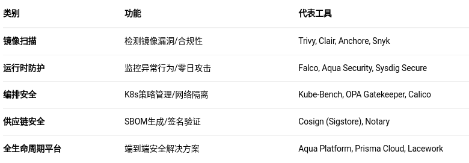
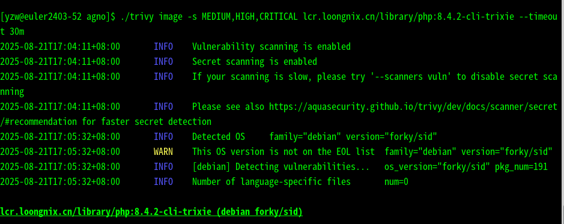

# 容器安全增强工具

### ​**​一、容器安心概念​**​

1. ​**​定义​**

   ​容器安全指保护容器化应用的整个生命周期（构建、分发、运行）免受漏洞、配置错误和恶意攻击的威胁，涵盖容器镜像、运行时环境、编排系统及供应链安全。
2. **选型考虑​**​
   * ​能否排查**​镜像风险​**​：包含漏洞的基镜像、敏感信息硬编码
   * ​是否可以**​隔离漏洞​**​：容器逃逸（如CVE-2019-5736）、共享内核攻击面
   * ​是否可以**​检测编排工具风险​**​：Kubernetes配置错误（如过度权限）
   * ​能否应对**​供应链攻击​**​：恶意第三方依赖（参考SolarWinds事件）

***

### ​**​二、容器安全工具分类​**​

​

1. **类别​**​



​

1. 镜像扫描工具介绍

由于docker自带的scan给你是10次使用/月，这里主要介绍trivy，该工具在阿里云镜像仓库也有使用。**​**​

​**​工具名称​**​：Trivy

* ​**​类型​**​：镜像扫描
* ​**​核心功能​**​：
  * 检测OS包+语言依赖漏洞（CVE/NVD数据库）
  * 支持CI/CD集成（Jenkins/GitHub Actions）
  * 输出SARIF/JSON格式报告
* ​**​使用场命**​`t`
  ```
  trivy image --severity CRITICAL myapp:latest
  ```
  

####

1. 运行时防护工具介绍

falco作为CNCF孵化项目，支持 Kernel Module、eBPF Probe和用户空间检测 3 种方式，目前la架构已经支持了kernel module。


1. **​编排层​**​：NetworkPolicy限制Pod通信、RBAC最小权限
2. **​合规标准​**​：NIST SP 800-190、CIS Docker/K8s基准

   Cosign容器签名 cosign sign --key cosign.key myapp:latest

#### ​四、**&#x20;附录​**​

* ​**​术语表​**​：CVE、SBOM、零信任
* ​**​资源链接​**​：
  * [CIS Benchmark下载](https://www.cisecurity.org/benchmark/)
  * [CNCF安全白皮书](https://github.com/cncf/tag-security)


