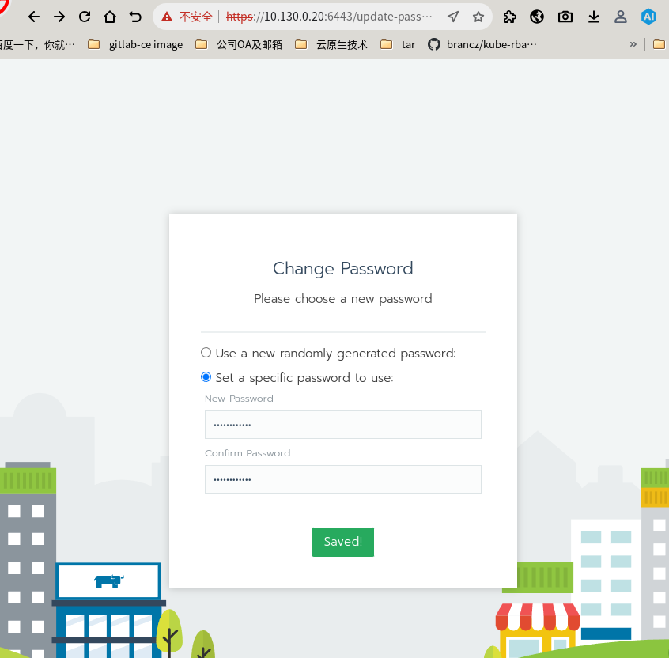
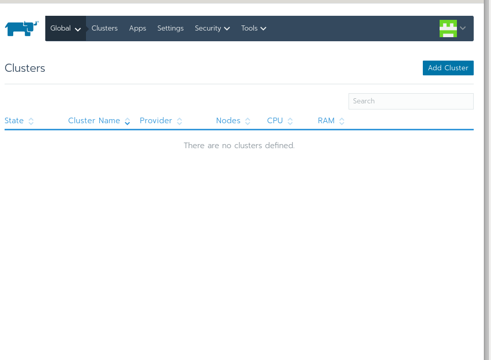

# k8s 集群管理工具使用

# 背景：

&#x20;   搭建k8s集群来进行测试验证客户问题、学习使用、文件服务器管理、cloud软件包仓库维护、CI/CD服务运行等。

&#x20;   目前已经在内网部署了一套k8s集群，木器

# 环境配置：

### &#x20;   1. 预设两个集群，使用rancher管理

&#x20;   内网 集群1： 1个master 3个worker 已部署

&#x20;   master 和2个worker是abi2.0的虚拟机 另有一台abi1.0的物理机

&#x20;   ip: 

&#x20;   10.130.0.153 master

&#x20;   10.130.0.106 node

&#x20;   10.130.0.143 node1

&#x20;   10.130.0.10 node2 abi1.0

&#x20;   隔离区 集群2： 1个master 2个worker 待部署

### &#x20;   2. 预设label（diy）

&#x20;   节点虚拟机/物理机 node.kubernetes.io/instance-type=vm/baremetal

&#x20;   节点abi node.kubernetes.io/instance-abi=1/2

&#x20;   节点是否挂载文件nfs storage.kubernetes.io/nfs-os=true

&#x20;   

# 部署

&#x20;   rancher的部署策略分为两类： 公有云部署、本地部署

&#x20;   本地部署可以使用docker 一键部署在物理机或部署在k8s上，在这里为了简单使用进行管理，且实际使用场景对rancher本身的高可用要求不高，采用docker 一键部署。

```
docker run -d --restart=unless-stopped -p 8192:80 -p 6443:443 cr.loongnix.cn/rancher/rancher
```

部署在abi1.0的服务器上 ,部署后访问http://10.130.0.20:6443

设置密码 loongson@123





# 配置k8s集群
