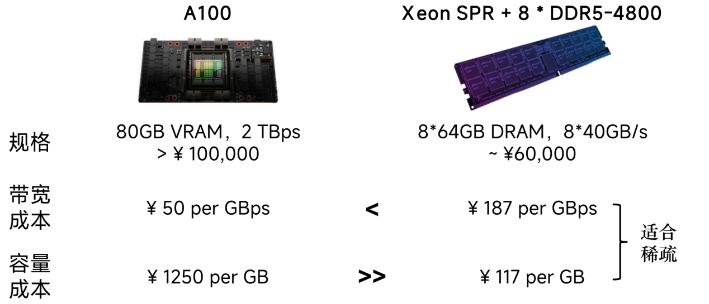
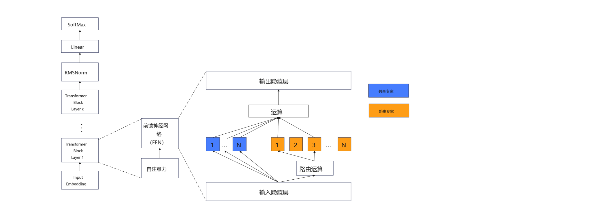

# kTransformer推理框架调研报告

# kTransformer推理框架调研报告

## 摘要

kTransformer是一种以异构资源极致利用为核心的推理框架，它旨在利用较少的GPU硬件提供基于MoE架构的千亿规模的大语言模型的部署能力，并达到基本可用的输出速度。本报告将对kTransformer的技术特点、优势、适用范围进行详细分析，并探讨其存在的问题，同时进行性能评估和应用场景分析，并与现有技术进行对比分析，最后提出可能的改进方向。

## 1. 技术特点和优势

### 1.1 技术特点

* **显存优化与异构计算策略**：KTransformers通过动态显存划分和稀疏计算优化，显著降低大模型推理的显存需求。其核心创新在于：

1. MoE架构的稀疏性利用：仅激活部分模型参数（如MoE模型的专家模块），将稀疏计算部分卸载到CPU/DRAM处理，减少GPU显存占用。例如，DeepSeek-R1（671B参数）可在24GB显存的RTX 4090显卡上运行
2. 异构计算划分：将密集计算部分保留在GPU，稀疏计算转移至CPU，结合CUDAGraph减少CPU-GPU通信开销，推理速度最高达14 tokens/s。
3. 对比vLLM：vLLM通过PagedAttention和连续批处理（Continuous Batching）优化显存，但主要依赖GPU计算，显存需求随序列长度线性增长。而KTransformers通过CPU卸载策略，在处理长序列（如100k tokens以上）时显存占用仅为vLLM的20%

* **量化与计算加速**：支持多种量化策略（如Q2\_K\_XL量化），结合Unsloth优化框架，实现每秒9.1 tokens的推理速度。通过YAML模板注入，开发者可灵活选择量化级别和内核替换方案，平衡速度与精度。
* **兼容性与易用性**：提供与Hugging Face Transformers兼容的API和ChatGPT式Web界面，降低开发者迁移成本。支持动态批处理与多模态模型适配（如文本生成、图像处理），扩展了应用场景。

### 1.2 优势

* **低成本推理**：在消费级显卡（如RTX 4090）上实现千亿级模型部署，打破传统需多卡集群的限制，推理成本降低90%以上。
* **高效资源利用率**

1. KV Cache优化：通过稀疏化策略（如动态窗口和H2O算法）压缩显存占用，处理4096 tokens长序列时显存消耗仅为同类框架的20%。
2. 端到端加速：预处理阶段速度达286 tokens/s，生成阶段速度提升3倍，适用于实时对话和长文本生成。

* **生态适配性**：支持MoE架构模型的快速适配（如DeepSeek V3），集成了开源工具链（如llama.cpp），满足私有化部署需求。

## Ktransformer的创新点

* **相比显存，内存容量大带宽低，适合稀疏运算。**

  {width="5.764583333333333in" height="2.4756944444444446in"}

  
* **在MoE模型中，前馈网络(FFN)层从一个大的稠密矩阵变成了数百个稠密的小矩阵，每次运算只会激活6\~8个小矩阵。**

  {width="6.310416666666667in" height="3.3513888888888888in"}

  

根据参数规模和运算强度，对每一层的运算进行了重新任务划分，将多重注意力（Multi-Level Attention）和共享专家、路由和层归一化的数据放在显存中，并由GPU运算，将路由专家的运算交由CPU运算，在MoE架构中，路由专家的参数占比超过了总参数的95%,运算量只占一半，而其余部分的总参数占比5%以下，运算量占一半。在MoE架构中，每个token输出时只相当于运算量基本只相当于运行一个37B的小模型，因此KV Cache的规模只有同量级参数模型的1/10。

```
{width="5.576388888888889in" height="2.71875in"}
```

## 性能评估

测试平台规格如下：

|     |                                             |
| --- | ------------------------------------------- |
| 组件  | 规格                                          |
| CPU | Intel 志强W5-3423单路（12C24T,基频2.1GHz，睿频4.2GHz） |
| 内存  | DDR5 ECC REG 48G\*8 （频率4400）                |
| 显卡  | RTX 4090 48G                                |
| 硬盘  | NVME4.0 4T                                  |

达到了Ktransformer宣称的使用DeepSeek-R1 4Bit量化版的最低配置要求，测试结果如下：

|                                    |               |
| ---------------------------------- | ------------- |
| 模型规格                               | 输出速率          |
| DeepSeek-R1 671B INT4              | 3.87 tokens/s |
| DeepSeek-R1 671B 1.58BIT （CPU+GPU） | 4.84 tokens/s |
| DeepSeek-R1 671B 1.58BIT （纯CPU）    | 1.42 tokens/s |
| DeepSeek-R1 671B 1.58BIT （传统流水线并行) | 1.48tokens/s  |

从测试结果来看，DeepSeek-R1在ktransoformer下取得较高的加速比，相较于纯CPU运算，和将2～3层放置到GPU的传统的流水线并行，ktransformer取得了240%的输出速度提升。

## 4. 性能瓶颈与局限

kTransformer将95%的参数和50%的运算量卸载到CPU侧运算，这对CPU的性能和内存带宽提出了很高的需求，根据ktransoformer社区中爱好者的测试数据，同样核心和线程数的Intel志强处理器（双路32核64线程），在相差一代，分别使用DDR4和DDR5的同容量内存的情况下，DDR4只有DDR5平台的58%（5.7tokens/s ： 9.8tokens/s）。

对单路CPU的内存需求较大，ktransformer支持NUMA架构，但其优化仍处在初级阶段，为了避免节点间同步的开销，ktransoformer采取了将参数和cache等在两个节点间各复制一份的做法，ktransformer官方宣称，双路运行INT4量化的DeepSeek-R1模型时，需每个节点各512GB的内存。

CPU承担了大量的运算，并发能力弱，仅适合于1～3用户使用。

## 5. 移植所需的条件

|                                           |                                      |
| ----------------------------------------- | ------------------------------------ |
| \* 条件                                     | \* 当前状态                              |
| 支持高度量化模型（将参数规模减少到256GB以下，低于3C6000单路内存限制）  | \* ktransoformer已支持                  |
| ktransformer对AMD显卡的支持                     | 初步支持（仍有少量函数涉及PTX需要移植）                |
| Rocm环境                                    | LoongArch平台的HIP和Rocm版的Pytorch仍在编译过程中 |
| ktransoformer中对AVX512、AVX2、AMX等x86向量指令的优化 | 由宏控制，需修改编译参数，需使用Rocm版的Pytorch        |

## 结论

kTransformer推理模型针对Moe模型中不同阶段的运算和仿真特点，优化CPU和GPU的算力分配，实现了CPU和GPU的高效协同，在单GPU等较低构建成本的环境下提供了一种高效的DeepSeek-R1大模型全量参数的推理框架。

