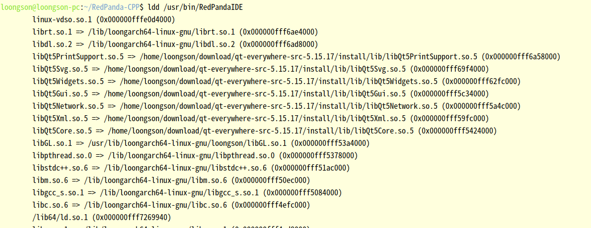

# kylin v10系统 编译qt 5.15.17及使用

# 构建环境

kylin v10系统， 基础系统中qt版本为 5.12，会出现很多应用不满足情况。可以在系统中构建相对较高版本的qt 5.15.17版本进行使用。

# 构建 qt 5.15.17

## 安装依赖

参考 [debian](https://so.csdn.net/so/search?q=debian\&spm=1001.2101.3001.7020) 5.15.2的依赖进行安装。

```
Build-Depends: debhelper-compat (= 11),
               default-libmysqlclient-dev,
               dh-exec,
               dpkg-dev (>= 1.17.14),
               firebird-dev [kfreebsd-any linux-any],
               freetds-dev,
               libasound2-dev [linux-any],
               libatspi2.0-dev,
               libcups2-dev,
               libdbus-1-dev,
               libdouble-conversion-dev,
               libdrm-dev [linux-any],
               libfontconfig1-dev,
               libfreetype6-dev,
               libgbm-dev [linux-any kfreebsd-any],
               libgl-dev,
               libgles2-mesa-dev,
               libglib2.0-dev,
               libglu1-mesa-dev | libglu-dev,
               libgtk-3-dev,
               libharfbuzz-dev (>= 1.6.0~),
               libicu-dev,
               libinput-dev [linux-any],
               libjpeg-dev,
               libkrb5-dev,
               libmtdev-dev [linux-any],
               libpcre2-dev,
               libpng-dev,
               libpq-dev,
               libproxy-dev,
               libpulse-dev,
               libsqlite3-dev,
               libssl-dev,
               libudev-dev [linux-any],
               libvulkan-dev [linux-any],
               libx11-dev,
              libx11-xcb-dev,
               libxcb-glx0-dev,
               libxcb-icccm4-dev,
               libxcb-image0-dev,
               libxcb-keysyms1-dev,
               libxcb-randr0-dev,
               libxcb-render-util0-dev,
               libxcb-render0-dev,
               libxcb-shape0-dev,
               libxcb-shm0-dev,
               libxcb-sync-dev,
               libxcb-util-dev,
               libxcb-xfixes0-dev,
               libxcb-xinerama0-dev,
               libxcb-xinput-dev,
               libxcb-xkb-dev,
               libxcb1-dev,
               libxext-dev,
               libxi-dev,
               libxkbcommon-dev,
               libxkbcommon-x11-dev,
               libxrender-dev,
               libzstd-dev,
               pkg-config,
               pkg-kde-tools (>= 0.15.17~),
               publicsuffix,
               qt5-qmake-bin <cross>,
               unixodbc-dev,               zlib1g-dev
```

## 构建 qt源码

使用 qt-everywhere-src-5.15.17 代码，

./configure --prefix=指定安装路径 -nomake examples -nomake tests

确保配置过程中不出息错误，

当前遇到的错误：源码路径存在中文字符的错误，需要使用全英文路径

make -j8

make -j8 install

## 使用qt

可以在 .bashrc文件中添加，其中QTDIR可根据自己安装目录调整。

alias switch-to-qt5='export QTDIR=/home/xxx/download/qt-everywhere-src-5.15.17/install; export PATH=QTDIR/bin:PATH; export LD\_LIBRARY\_PATH=LD\_LIBRARY\_PATH; export QT\_PLUGIN\_PATH=QT\_PLUGIN\_PATH; export QML2\_IMPORT\_PATH=QML2\_IMPORT\_PATH; echo "Switched to Qt 5.15.17"'

alias check-qt-version='qmake --version'

## 验证

编译 RedPanda-CPP v3.3进行验证

需要修改代码

```
 
---
 packages/debian/rules                 | 4 +++-
 tools/consolepauser/consolepauser.pro | 2 +-
 2 files changed, 4 insertions(+), 2 deletions(-)
 
diff --git a/packages/debian/rules b/packages/debian/rules
index e1c6e9ac..88b2d4fe 100755
--- a/packages/debian/rules
+++ b/packages/debian/rules
@@ -5,4 +5,6 @@ export QT_SELECT=qt5
 export DEB_BUILD_MAINT_OPTIONS = hardening=+all
 
 %:
-       dh ${@} --buildsystem qmake
\ No newline at end of file
+       dh ${@} --buildsystem qmake
+override_dh_shlibdeps:
+       dh_shlibdeps --dpkg-shlibdeps-params=--ignore-missing-info
diff --git a/tools/consolepauser/consolepauser.pro b/tools/consolepauser/consolepauser.pro
index 2dd6912b..0c94dece 100644
--- a/tools/consolepauser/consolepauser.pro
+++ b/tools/consolepauser/consolepauser.pro
@@ -24,7 +24,7 @@ SOURCES += \
 # macOS does not provide rt library, only use it for Linux
 linux: {
 LIBS+= \
-    -lrt
+    -lrt -lstdc++fs
 }
  win32: {
```

修改rules文件，避免因为非deb安装而出现错误，增加 -lstdc++fs保证在 gcc 8.3环境上能够编译通过。

然后 执行 bash packages/debian/builddeb.sh，编译好的deb包会在 /tmp目录下

## 使用编译后的包

查看 RedPandaIDE依赖



启动程序
