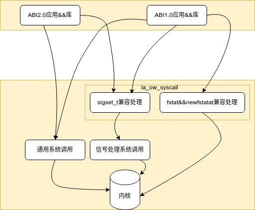
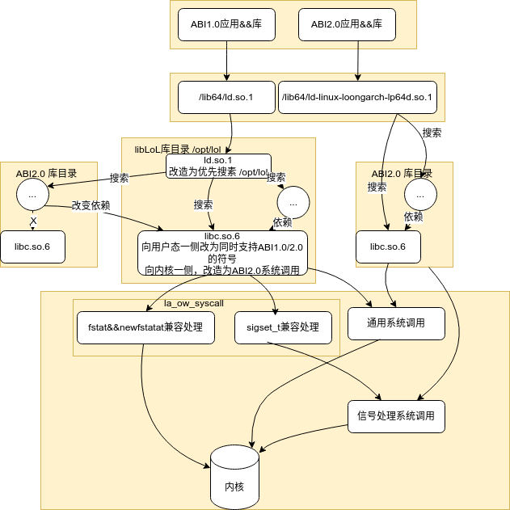
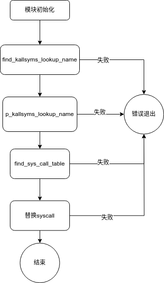
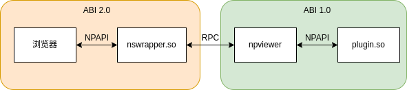
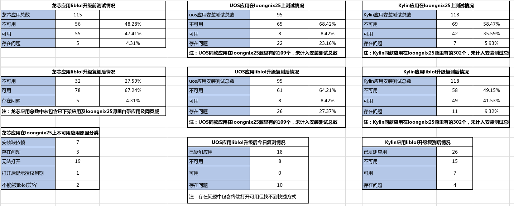

# libLOL兼容方案

# 一、方案原理

## 1.1 libLoL组成部分

1）内核模块：提供旧世界系统调用 ABI 的支持。主要查找部分系统符号，然后使用kprobe机制插桩，替换成模块中实现的函数。

| 序号 | 函数名                   |
| -- | --------------------- |
| 1  | vfs\_fstatat          |
| 2  | vfs\_fstatat          |
| 3  | sys\_setxattr         |
| 4  | sys\_close            |
| 5  | sys\_clone            |
| 6  | sys\_rt\_sigprocmask  |
| 7  | sys\_rt\_sigpending   |
| 8  | sys\_rt\_sigtimedwait |
| 9  | sys\_rt\_sigaction    |
| 10 | sys\_rt\_sigsuspend   |
| 11 | sys\_pselect6         |
| 12 | sys\_ppoll            |
| 13 | sys\_signalfd4        |
| 14 | sys\_epoll\_pwait     |
| 15 | sys\_epoll\_pwait2    |

2） 运行时：为动态链接的旧世界应用提供依赖组件，通过使用patchelf方式修改开源社区的glibc库，在符号表中增加支持低版本的符号支持，同时设置此C库为优先加载路径。


## 1.2 方案特点

libLoL 的基本特点如下：

&#x20;体积小：目前仅需要一个模块和glibc编译出来的库文件。

兼容性：提供修改过的 glibc。该 glibc 同时提供ABI1.0/2.0版本的符号，以便ABI1.0的可执行程序加载新世界的动态链接库，从而复用宿主系统已有的库。

内核：使用模块方式，动态 patch 系统调用表，不侵入架构无关逻辑，一旦使用此模块，内核中如表 1中所示的系统调用都会通过模块路径执行。

ucontext处理：*如果用户态程序存在操作ucontext中内容的操作，*&#x76EE;前方案仍无法处理。

 

在内核和用户态之间，系统调用兼容性的实现方式如下图。 此图所描述的数据流适用于静态链接的程序，或自己负责一部分系统调用的动态链接的程序： 这些程序的共同特点是部分或全部系统调用无法被 libLoL 在用户态轻易截获，因此必须在内核层面加入相应处理。



系统调用原理再加上C库的图如下。



# 二、方案实现

根据方案原理分析，方案需要实现3个部分：

1）改造用户态C库，保证能够同时支持ABI1.0/2.0的符号，同时设定库的搜索路径优先为改造的C库，增加部分不兼容的系统调用支持，增加ABI1.0符号支持，生成部分已经合并到libc中的库文件支持（libpthread.so等）；

2）内核态能够截获部分系统调用，并转换成ABI2.0支持的系统调用；

3）安装工具增加兼容支持。


## 2.1 内核实现



如上图所示，内核模块主要代码流程为探查相应的系统调用函数并使用模块中的实现进行接管，在模块中区分fstat, newfstatat和sigset\_t大小相关的系统调用函数。

## 2.2 用户态库


2.2.1 patchelf
增加接口用于修改C库相关二进制，增加低版本符号支持，主要增加接口为remapSymvers。修改rebuildGnuHashTable和rebuildHashTable接口用于支持更多符号。

```
void remapSymvers(const std::string ＆mapTo, const std::vector<std::string>   ＆mapFrom, bool alsoRemapVerneed);
```


### 2.2.2 glibc&#xA;

1\) 增加nptl支持libpthread的低版本符号；

2\) 增加libc中支持的符号版本，修改默认的动态加载器；

3\)增加sigset\_t相关的兼容代码，包括\_\_SIGRTMAX修改，sigaddset，sigandset,sigdelset,sigempty,sigfillset,sigismem,sigisempty,sigorset等接口的区分实现；

4\) 增加pthread\_sigmask, NSIG,sigpending,sigprocmask,sigsuspend,sigtimedwait,sigwait,sigwaitinfo,spawnattr\_setdefault,spawnattr\_setsigmask支持；

5\) 增加 getcontext, setcontext, makecontext,swapcontext,sigaction相关支持；

6\) 增加epoll\_pwait，epoll\_pwait2,ppoll,pselect,signalfd,ppoll\_chk,spawnattr\_getdefault,spawnattr\_getsigmask等实现；

7\) 增加79/80号系统调用，同时增加fxstat64,fxstatat64,lxstat64,xstat64等接口使用 statx系统调用；

8\) 将pthread相关函数从libc中分离出来，放到libpthread库中；

9\) 取消HAVE\_CLONE3\_WRAPPER定义；

10\) 增加动态加载器的加载路径，优先加载user-defined-trusted-dirs-pre中的库；

11\) 增加\_\_\_brk\_addr符号；

12\) 增加errlist和siglist的兼容代码。

2.3 安装工具


dpkg需要增加loongarch64的支持，保证ABI1.0的包能够安装。

```
--- dpkg-1.22.11.orig/lib/dpkg/arch.c
+++ dpkg-1.22.11/lib/dpkg/arch.c
@@ -146,6 +146,9 @@ dpkg_arch_find(const char *name)
 for (arch = arch_head; arch; arch = arch->next) {
 
 if (strcmp(arch->name, name) == 0)
 
 return arch;
 
+  if (strcmp(arch->name, "loong64") == 0 &&
 
+  strcmp(name, "loongarch64") == 0)
 
+  return arch;
 
 last_arch = arch;
 
 }
```


2.4 浏览器兼容


### 2.4.1 兼容原理&#xA;

使用 nspluginwrapper 搭配 libLoL 的兼容方案，其中 libLoL 用来运行ABI1.0程序，nspluginwrapper 用来解决ABI2.0浏览器无法直接加载ABI1.0插件的问题。

nspluginwrapper 兼容的实现机制如下图：



为每个 abi1.0 NPAPI 插件，如 plugin.so 创建一个 abi2.0 的代理插件 nspluginwrapper.so。代理插件被浏览器初始化时会启动 abi1.0 的 npviewer 独立程序（通过 libLoL 兼容），并借助其加载 plugin.so。当浏览器调用插件接口时，代理插件通过 RPC 通信，控制 npviewer 程序调用插件并获得返回值。这种方案，理论上浏览器无需额外改动，在其视角下，nswrapper.so 就是一个普通的 NPAPI 插件。

### 2.4.2 系统集成&#xA;

集成 nspluginwrapper 主要涉及三个文件：

· npviewer：用来加载旧世界插件的旧世界程序；

&#x20;   · 

· npwrapper.so：代理插件的模板文件，通过修改这个文件来生成具体的代理插件；

&#x20;   · 

· npw-generate：读取旧世界插件信息，并据此修改 npwrapper.so 生成实际的代理插件库文件；

&#x20;   · 

目前 npw-generate 程序逻辑是遍历输入目录，并为其中的所有插件生成代理插件，保存到输出目录。

三、测试


3.1 loongnix/UOS/Kylin测试




3.2容器测试


总共测试了4类容器，分别是java,go,C,python语言的容器，目前java容器存在问题。

| 容器类型                | 测试结果                    |
| ------------------- | ----------------------- |
| elasticsearch(java) | 不能正常运行，初步分析存在ucontext访问 |
| influxdb(go)        | 可以运行                    |
| mysql(C)            | 可以运行                    |
| python              | 可以运行                    |


3.3 浏览器插件测试


测试平台为： 3A5000 + Deepin V23 + Linux 6.9.6 + Glibc 2.38 + liblol 0.1.8

| 插件            | 兼容性                | 说明                                                                                                          |
| ------------- | ------------------ | ----------------------------------------------------------------------------------------------------------- |
| WPS OFD       | 可用                 | 需添加 libldap\_r-2.4.so.2, liblber-2.4.so.2, libwebp.so.6                                                     |
| foxit OFD     | 可用                 |                                                                                                             |
| 数科OFD         | 可用                 | 需添加 libssl.so.1.1, libcrypto.so.1.1                                                                         |
| 金格 iWebOffice | liblol 做特别适配后可用    | 1.安装包会在 ld.so.conf.d 下添加库搜索路径，但对 abi1.0 程序似乎未生效 将安装包的库拷贝到 libLoL 的库路径后插件可以使用                                |
| NTKO Office   | 不可用                | ERROR: /usr/lib/loongarch64-debian-linux-gnuow/preload/libpthread.so.0: version \`GLIBC\_PRIVATE' not found |
| 永中 Office     | 可以加载但黑屏            |                                                                                                             |
| VLC 视频播放器     | 可以加载但黑屏            | 开源插件，可编译新世界版本                                                                                               |
| IcedTea Java  | 调整 java 路径后可以加载但白屏 | 1.插件默认调用的 java 路径中使用了 loongarch64，而 deepin v23 中实际路径为 loong64 2.白屏的问题怀疑是 nspluginwrapper 的问题 开源插件，可编译新世界版本  |

3.4 杀毒软件测试


共测试12款杀毒软件，都无法直接运行。

| 软件名称                 |
| -------------------- |
| 北信源防病毒系统V3.0         |
| 辰信领创防病毒系统v7.0        |
| 火绒终端安全管理系统V2.0       |
| 江民防病毒系统V21           |
| 毒霸防病毒系统V9.0          |
| 360终端安全防护系统          |
| 瑞星ESM防病毒系统V3.0       |
| 奇安信终端安全管理系统V8.0      |
| 腾讯安全-零信任安全管理系统V5.0   |
| 亚信安全端点安全管理系统ESM V8.0 |
| 金山毒霸V1.0             |
| 安天智甲终端防御系统V3.0       |

3.5 输入法测试


输入法无法使用兼容方案进行兼容。

## 3.6 测试存在问题分析

通过分析，目前libLOL方案存在五类主要问题：

1\. patchelf增加PT\_LOAD segment后行为发生变化，原来应该清空的bss段在6.6内核中处理不正确，更高版本内核修改了elf文件bss探查逻辑。

解决方法：对安装后的库进行strip操作。

2\. 根据libLOL方案技术特点分析，可能会存在同时加载系统/lib64/ld-linux-loongarch-lp64d.so.1，又加载ld.so.1的情况，导致查找符号的时候存在libc.so与动态连接器不匹配的情况出错。

解决方法：与系统使用相同版本的C库作为基础进行兼容库制作，此方法已经验证过部分程序有效。

3\. 存在应用搜索库路径为绝对路径情况，或者只搜索修改后的路径，不搜索系统路径情况。

4\. 部分应用使用的库版本低于系统版本，此类应用可能需要添加低版本库支持才能够运行。

解决方法：在ABI1.0系统上找到缺少的库并安装到 /opt/lol/lib下。

5\. 安装在/usr/local下的包查找库的路径存在问题。


[]()

[]()
