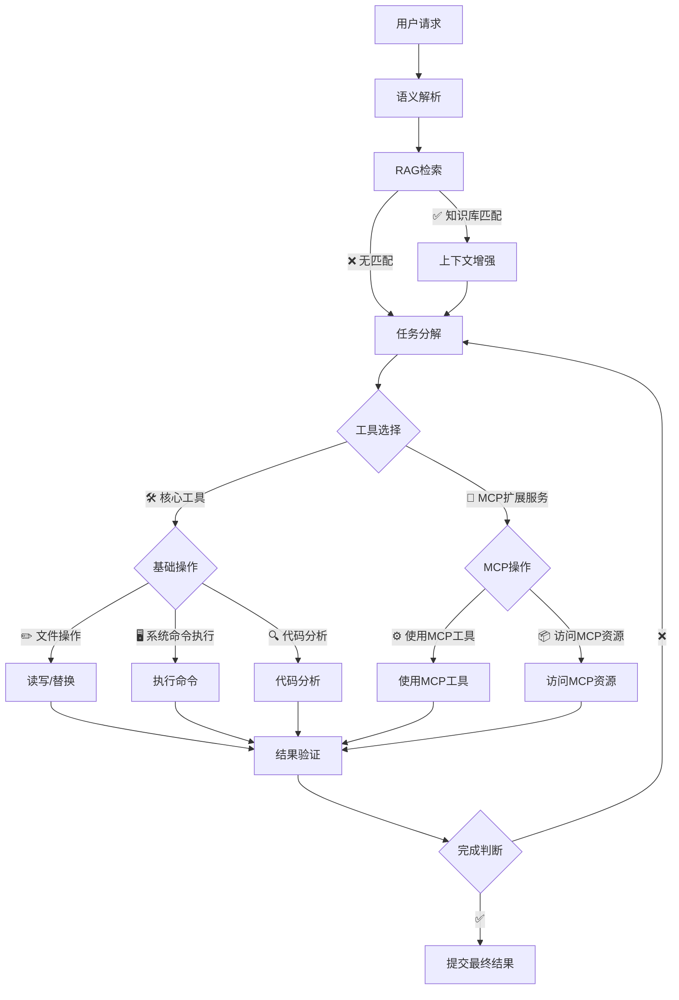
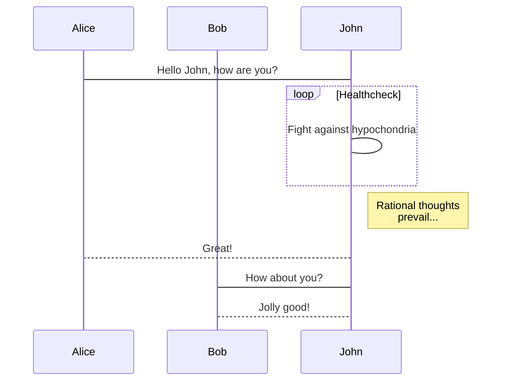
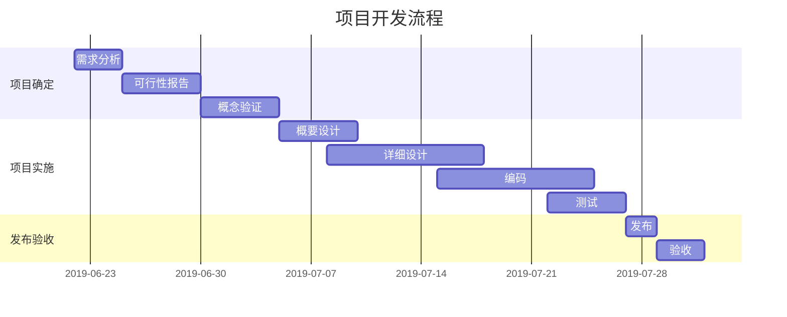

# libcontainer源码分析

[libcontainer]()，是目前整个容器虚拟化生态的最终底座，依赖传导如下：
kubernetes -> dockerd -> containerd -> runc -> libcontainer
libcontainer目前作为runc项目的一部分存在，是runc的核心运行时库，

核心模块拆解：

1. config 容器配置
2. cgroups cgroups配置
3. namespaces 命名域配置
4. capabilities 能力管理
5. rootfs 文件系统隔离
6. 容器生命周期管理

其中，config是获取用户声明的已有资源或生成新的资源来为当前启动的容器进行配置，确保新启动的容器有资源可用。

---

## 核心模块一Config

**微注**：

### Config中的关键数据结构

```
https://github.com/docker-archive/libcontainer/blob/master/configs/config.go
type Config struct {
    Rootfs          string          `json:"rootfs"`
    Readonlyfs      bool            `json:"readonlyfs"`
    Hostname        string          `json:"hostname"`
    Namespaces      Namespaces      `json:"namespaces"`
    Capabilities    *Capabilities   `json:"capabilities"`
    Networks        []*Network      `json:"networks"`
    Cgroups         *Cgroup         `json:"cgroups"`
    Devices         []*Device       `json:"devices"`
    Mounts          []*Mount        `json:"mounts"`
    Routes 	    []*Route 	    `json:"routes"`
    Rlimits 	    []Rlimit 	    `json:"rlimits"`
    UidMappings     []IDMap  	    `json:"uid_mappings"`
    GidMappings     []IDMap 	    `json:"gid_mappings"`
    Seccomp *Seccomp `json:"seccomp"`
    // ... 其他关键字段如是否启用pivot
}
```

可以注意到，config结构体就是容器启动时需要的一些参数，在这里只列举一些关键属性。
具体定义的结构类型可以到具体的golang文件下查看。

```
https://github.com/docker-archive/libcontainer/blob/master/configs/cgroup.go
type Cgroup struct {
	Name string `json:"name"`
	// name of parent cgroup or slice
	Parent string `json:"parent"`

	// If this is true allow access to any kind of device within the container.  If false, allow access only to devices explicitly listed in the allowed_devices list.
	AllowAllDevices bool `json:"allow_all_devices"`
	AllowedDevices []*Device `json:"allowed_devices"`
	DeniedDevices []*Device `json:"denied_devices"`

	// Memory limit (in bytes)
	Memory int64 `json:"memory"`
	// Memory reservation or soft_limit (in bytes)
	MemoryReservation int64 `json:"memory_reservation"`
	// Total memory usage (memory + swap); set `-1' to disable swap
	MemorySwap int64 `json:"memory_swap"`

	// Kernel memory limit (in bytes)
	KernelMemory int64 `json:"kernel_memory"`
	// CPU shares (relative weight vs. other containers)
	CpuShares int64 `json:"cpu_shares"`
	// CPU hardcap limit (in usecs). Allowed cpu time in a given period.
	CpuQuota int64 `json:"cpu_quota"`
	// CPU period to be used for hardcapping (in usecs). 0 to use system default.
	CpuPeriod int64 `json:"cpu_period"`
	// CPU to use
	CpusetCpus string `json:"cpuset_cpus"`
	// MEM to use
	CpusetMems string `json:"cpuset_mems"`

	// IO read rate limit per cgroup per device, bytes per second.
	BlkioThrottleReadBpsDevice string `json:"blkio_throttle_read_bps_device"`
	// IO write rate limit per cgroup per divice, bytes per second.
	BlkioThrottleWriteBpsDevice string `json:"blkio_throttle_write_bps_device"`
	// IO read rate limit per cgroup per device, IO per second.
	BlkioThrottleReadIOpsDevice string `json:"blkio_throttle_read_iops_device"`
	// IO write rate limit per cgroup per device, IO per second.
	BlkioThrottleWriteIOpsDevice string `json:"blkio_throttle_write_iops_device"`

	// Specifies per cgroup weight, range is from 10 to 1000.
	BlkioWeight int64 `json:"blkio_weight"`
	// Weight per cgroup per device, can override BlkioWeight.
	BlkioWeightDevice string `json:"blkio_weight_device"`
	// set the freeze value for the process
	Freezer FreezerState `json:"freezer"`

	// Hugetlb limit (in bytes)
	HugetlbLimit []*HugepageLimit `json:"hugetlb_limit"`
}
```


---

## 什么是 Markdown

`Markdown` 是一种方便记忆、书写的纯文本标记语言，用户可以使用这些标记符号，以最小的输入代价，生成极富表现力的文档：譬如您正在阅读的这份文档。它使用简单的符号标记不同的标题，分割不同的段落，**粗体**、*斜体* 或者[超文本链接](https://vue-cli3.lovejade.cn/explore/)，更棒的是，它还可以：

---

### 1. 制作待办事宜 `Todo` 列表

- [x] 🎉 通常 `Markdown` 解析器自带的基本功能；
- [x] 🍀 支持**流程图**、**甘特图**、**时序图**、**任务列表**；
- [x] 🏁 支持粘贴 HTML 自动转换为 Markdown；
- [x] 💃🏻 支持插入原生 Emoji、设置常用表情列表；
- [x] 🚑 支持编辑内容保存**本地存储**，防止意外丢失；
- [x] 📝 支持**实时预览**，主窗口大小拖拽，字符计数；
- [x] 🛠 支持常用快捷键(**Tab**)，及代码块添加复制
- [x] ✨ 支持**导出**携带样式的 PDF、PNG、JPEG 等；
- [x] ✨ 升级 Vditor，新增对 `echarts` 图表的支持；
- [x] 👏 支持检查并格式化 Markdown 语法，使其专业；
- [x] 🦑 支持五线谱、及[部分站点、视频、音频解析](https://github.com/b3log/vditor/issues/117?ref=hacpai.com#issuecomment-526986052)；
- [x] 🌟 增加对**所见即所得**编辑模式的支持(`⌘-⇧-M`)；

---

### 2. 书写一个质能守恒公式[^LaTeX]

$$
E=mc^2
$$

---

### 3. 高亮一段代码[^code]

```js
// 给页面里所有的 DOM 元素添加一个 1px 的描边（outline）;
[].forEach.call($$("*"),function(a){
  a.style.outline="1px solid #"+(~~(Math.random()*(1<<24))).toString(16);
})
```

---

### 4. 高效绘制[流程图](https://github.com/knsv/mermaid#flowchart)



---

### 5. 高效绘制[序列图](https://github.com/knsv/mermaid#sequence-diagram)



---

### 6. 高效绘制[甘特图](https://github.com/knsv/mermaid#gantt-diagram)

> **甘特图**内在思想简单。基本是一条线条图，横轴表示时间，纵轴表示活动（项目），线条表示在整个期间上计划和实际的活动完成情况。它直观地表明任务计划在什么时候进行，及实际进展与计划要求的对比。



### 7. 支持图表

```echarts
{
  "backgroundColor": "#212121",
  "title": {
    "text": "「晚晴幽草轩」访问来源",
    "subtext": "2019 年 6 月份",
    "x": "center",
    "textStyle": {
      "color": "#f2f2f2"
    }
  },
  "tooltip": {
    "trigger": "item",
    "formatter": "{a} <br/>{b} : {c} ({d}%)"
  },
  "legend": {
    "orient": "vertical",
    "left": "left",
    "data": [
      "搜索引擎",
      "直接访问",
      "推荐",
      "其他",
      "社交平台"
    ],
    "textStyle": {
      "color": "#f2f2f2"
    }
  },
  "series": [
    {
      "name": "访问来源",
      "type": "pie",
      "radius": "55%",
      "center": [
        "50%",
        "60%"
      ],
      "data": [
        {
          "value": 10440,
          "name": "搜索引擎",
          "itemStyle": {
            "color": "#ef4136"
          }
        },
        {
          "value": 4770,
          "name": "直接访问"
        },
        {
          "value": 2430,
          "name": "推荐"
        },
        {
          "value": 342,
          "name": "其他"
        },
        {
          "value": 18,
          "name": "社交平台"
        }
      ],
      "itemStyle": {
        "emphasis": {
          "shadowBlur": 10,
          "shadowOffsetX": 0,
          "shadowColor": "rgba(0, 0, 0, 0.5)"
        }
      }
    }
  ]
}
```

> **备注**：上述 echarts 图表📈，其数据，须使用严格的 **JSON** 格式；您可使用 JSON.stringify(data)，将对象传换从而得标准数据，即可正常使用。

---

### 8. 绘制表格

| 作品名称        | 在线地址   |  上线日期  |
| :--------  | :-----  | :----:  |
| 逍遥自在轩 | [https://niceshare.site](https://niceshare.site/?ref=markdown.lovejade.cn) |2024-04-26|
| 玉桃文飨轩 | [https://share.lovejade.cn](https://share.lovejade.cn/?ref=markdown.lovejade.cn) |2022-08-26|
| 缘知随心庭 | [https://fine.niceshare.site](https://fine.niceshare.site/?ref=markdown.lovejade.cn) |2022-02-26|
| 静轩之别苑 | [http://quickapp.lovejade.cn](http://quickapp.lovejade.cn/?ref=markdown.lovejade.cn) |2019-01-12|
| 晚晴幽草轩 | [https://www.jeffjade.com](https://www.jeffjade.com/?ref=markdown.lovejade.cn) |2014-09-20|

---

### 9. 更详细语法说明

想要查看更详细的语法说明，可以参考这份 [Markdown 资源列表](https://github.com/nicejade/nice-front-end-tutorial/blob/master/tutorial/markdown-tutorial.md)，涵盖入门至进阶教程，以及资源、平台等信息，能让您对她有更深的认知。

总而言之，不同于其它**所见即所得**的编辑器：你只需使用键盘专注于书写文本内容，就可以生成印刷级的排版格式，省却在键盘和工具栏之间来回切换，调整内容和格式的麻烦。**Markdown 在流畅的书写和印刷级的阅读体验之间找到了平衡。** 目前它已经成为世界上最大的技术分享网站 `GitHub` 和 技术问答网站 `StackOverFlow` 的御用书写格式，而且越发流行，正在在向各行业渗透。

最新更新于 2025.04.16
