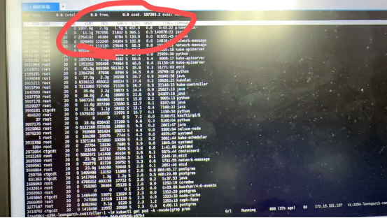

# prometheus的OOM问题排查

1. 问题背景

200台机器规模，uos20系统，内核4.19.

prometheus 版本2.37, 数据采集频率15s，timeout报警时间10s。

出现问题：当prometheus实际占用内存达到25g左右频繁重启(虚拟内存1T)

 

1. 问题分析

2.1 复现及简单分析

根据客户反馈信息及prometheus特性分析：

1. prometheus.yml 配置的内存限制在100g
2. prometheus机制是每2小时触发一次高并发大规模的数据落盘，此时会调用golang的mmap机制
3. 节点的物理内存在256g
4. 虚拟内存占用很高，在800g-1000g之间
5. 同样配置下x86没有出现OOM问题，x86操作系统是rocky 9.4 内核版本5.14

 

由于客户环境难以访问，先对部署的测试环境的OOM进行分析，分析堆栈信息可知是由于达到了100g内存的使用限制导致预期内的内存溢出。

```
[四 4月 17 18:48:52 2025] Memory cgroup stats for /kubepods.slice/kubepods-burstable.slice/kubepods-burstable-podb0b4b9ab_69ac_45c9_ba1d_25c0bc5c9e0d.slice/cri-containerd-56a6cbd9389e0c909cd4d8cf65e0b73dc93818913f26807533eb2bca82280f1a.scope: cache:8448KB rss:104844432KB rss_huge:0KB shmem:0KB mapped_file:5280KB dirty:0KB writeback:0KB swap:0KB workingset_refault_anon:0KB workingset_refault_file:80994672KB workingset_activate_anon:0KB workingset_activate_file:0KB workingset_restore_anon:0KB workingset_restore_file:0KB workingset_nodereclaim:0KB inactive_anon:104844432KB active_anon:0KB inactive_file:4752KB active_file:0KB unevictable:0KB
[四 4月 17 18:48:52 2025] Tasks state (memory values in pages):
[四 4月 17 18:48:52 2025] [  pid  ]   uid  tgid total_vm      rss pgtables_bytes swapents oom_score_adj name
[四 4月 17 18:48:52 2025] [1578890] 65535 1578890       56        1    98304        0          -998 pause
[四 4月 17 18:48:52 2025] [2983827]     0 2983827 16477927  6558421 66732032        0           961 prometheus
[四 4月 17 18:48:54 2025] oom_reaper: reaped process 2983827 (prometheus), now anon-rss:0kB, file-rss:0kB, shmem-rss:0kB
[四 4月 17 19:35:04 2025] prometheus invoked oom-killer: gfp_mask=0x6000c0(GFP_KERNEL), nodemask=(null), order=0, oom_score_adj=961
[四 4月 17 19:35:04 2025] prometheus cpuset=cri-containerd-3306c4278822cedfcaffcddb48647aeaf3d47ed4a1948eb70f03c13ea24d8174.scope mems_allowed=0-1
[四 4月 17 19:35:04 2025] CPU: 10 PID: 3347273 Comm: prometheus Kdump: loaded Not tainted 4.19.0-91.82.152.28.1.tmp.20240925114625.uelc20.loongarch64 #1
[四 4月 17 19:35:04 2025] Hardware name: LOONGSON Dabieshan/Loongson-LS2C50C2, BIOS Loongson UEFI (3C50007A2000_C2) V4.2.0-Dual 09/09/24 15:48:39
[四 4月 17 19:35:04 2025] Stack : 9000101f4607fa88 90000000012a36c0 9000101f4607c000 9000101f4607f9b0
[四 4月 17 19:35:04 2025]         0000000000000000 0000000000000000 0000000000000000 900000000232a451
[四 4月 17 19:35:04 2025]         900000000232a449 9000000002388a10 6572617764726148 39333a38343a3531
[四 4月 17 19:35:04 2025]         ffffffffffffffff ffffffffffffffff 0000000000000006 0000000000000007
[四 4月 17 19:35:04 2025]         9000000009400b50 0000000000000001 0000000000001087 0000000000000004
[四 4月 17 19:35:04 2025]         0000000000000000 0000000007228000 9000003fec179000 0000000000000000
[四 4月 17 19:35:04 2025]         ffff800000000000 9000101f4607f9b0 0000000000000000 900000000186f490
[四 4月 17 19:35:04 2025]         9000000001a31140 0000000000000001 9000101f4607fc18 0000000000000001
[四 4月 17 19:35:04 2025]         9000000000209c5c 000000d7efea3ff8 00000000000000b0 0000000000000007
[四 4月 17 19:35:04 2025]         0000000000000001 0000000000071c1c 0000000000020000 0000000000000000
[四 4月 17 19:35:04 2025]         ...
[四 4月 17 19:35:04 2025] Call Trace:
[四 4月 17 19:35:04 2025] [<9000000000209c5c>] show_stack+0x9c/0x190
[四 4月 17 19:35:04 2025] [<90000000012a36bc>] dump_stack+0xa4/0xdc
[四 4月 17 19:35:04 2025] [<90000000012990d0>] dump_memcg_header+0x1c/0x64
[四 4月 17 19:35:04 2025] [<90000000003c6a84>] oom_kill_process+0x394/0x3a0
[四 4月 17 19:35:04 2025] [<90000000003c75f4>] out_of_memory+0x1f4/0x600
[四 4月 17 19:35:04 2025] [<9000000000475aa4>] mem_cgroup_out_of_memory+0x114/0x160
[四 4月 17 19:35:04 2025] [<900000000047dbf4>] try_charge+0x814/0x880
[四 4月 17 19:35:04 2025] [<90000000004805cc>] mem_cgroup_charge+0xac/0x290
[四 4月 17 19:35:04 2025] [<9000000000417188>] handle_mm_fault+0x1078/0x1b20[四 4月 17 19:35:04 2025] [<90000000012b15b0>] do_page_fault+0x170/0x380
```

根据日志可以看到rss:104844432KB  使用的实际内存已经超过了100g。

与客户沟通，发现测试环境下出现的该OOM与实际现象不同。

 

2.2 问题分析

 

2.2.1 根据prometheus社区的反馈，在其他架构机器下也会出现oom现象，怀疑是否由于OOM瞬间请求了大量内存，但容器重启后没有保存现场导致。

实验：

使用golang的调试分析工具pprof 分析崩溃前后的内存使用情况及堆情况，具体如下：


 

结论：根据内存历史占用的情况来看，一共占用过700多g的内存，但是这是prometheus占用内存的总和，不足以说明由于物理内存不足导致的prometheus重启。

 

2.2.2 现场信息分析

 

远程查看客户机器的dmesg缓冲区信息，仅有最近一小时的内容，且由于现场环境不好修改，查看systemd日志及/var/log/messages来获取更多信息。

根据现场环境看到出现的OOM现象由java进程引起，再查看现场环境与java进程相关的服务，看到zookeeper服务调用了prometheus，猜想是否由于zookeeper服务调用java进程申请内存失败时 prometheus在监控zookeeper时通同样需要申请内存导致oom。

再次查看测试环境的OOM，环境内的OOM分为两类，分别是由于达到prometheus限制100g内存分配导致的OOM和java程序达到占用上限导致的OOM

现场OOM只有java引起的OOM。下面分别是上述的两类OOM日志。

 

1. 测试环境中prometheus导致的OOM日志

```
 四 4月 17 22:43:41 2025] prometheus invoked oom-killer: gfp_mask=0x6000c0(GFP_KERNEL), nodemask=(null), order=0, oom_score_adj=961
[四 4月 17 22:43:41 2025] prometheus cpuset=cri-containerd-ca3cb3d16034bd31d742d812a46e765f1781e081d747eb9ba2e715895082196e.scope mems_allowed=0-1
[四 4月 17 22:43:41 2025] CPU: 8 PID: 4112310 Comm: prometheus Kdump: loaded Not tainted 4.19.0-91.82.152.28.1.tmp.20240925114625.uelc20.loongarch64 #1
[四 4月 17 22:43:41 2025] Hardware name: LOONGSON Dabieshan/Loongson-LS2C50C2, BIOS Loongson UEFI (3C50007A2000_C2) V4.2.0-Dual 09/09/24 15:48:39
[四 4月 17 22:43:41 2025] Stack : 9000002e502679d8 90000000012a36c0 9000002e50264000 9000002e50267900
[四 4月 17 22:43:41 2025]         0000000000000000 0000000000000000 0000000000000000 900000000232a451
[四 4月 17 22:43:41 2025]         900000000232a449 900000000238c750 6572617764726148 39333a38343a3531
[四 4月 17 22:43:41 2025]         ffffffffffffffff ffffffffffffffff 0000000000000006 0000000000000007
[四 4月 17 22:43:41 2025]         9000000009000b50 0000000000000001 00000000000010ff 0000000000000004
[四 4月 17 22:43:41 2025]         0000000000000000 0000000006e28000 9000003fec179000 0000000000000000
[四 4月 17 22:43:41 2025]         ffff800000000000 9000002e50267900 0000000000000000 900000000186f490
[四 4月 17 22:43:41 2025]         9000000001a31140 0000000000000001 9000002e50267b68 0000000000000001
[四 4月 17 22:43:41 2025]         9000000000209c5c 000000d7ddbfbae0 00000000000000b0 0000000000000004
[四 4月 17 22:43:41 2025]         0000000000000001 0000000000071c1c 0000000000000000 0000000000000000
[四 4月 17 22:43:41 2025]         ...
[四 4月 17 22:43:41 2025] Call Trace:
[四 4月 17 22:43:41 2025] [<9000000000209c5c>] show_stack+0x9c/0x190
[四 4月 17 22:43:41 2025] [<90000000012a36bc>] dump_stack+0xa4/0xdc
[四 4月 17 22:43:41 2025] [<90000000012990d0>] dump_memcg_header+0x1c/0x64
[四 4月 17 22:43:41 2025] [<90000000003c6a84>] oom_kill_process+0x394/0x3a0
[四 4月 17 22:43:41 2025] [<90000000003c75f4>] out_of_memory+0x1f4/0x600
[四 4月 17 22:43:41 2025] [<9000000000475aa4>] mem_cgroup_out_of_memory+0x114/0x160
[四 4月 17 22:43:41 2025] [<900000000047dbf4>] try_charge+0x814/0x880
[四 4月 17 22:43:41 2025] [<90000000004805cc>] mem_cgroup_charge+0xac/0x290
[四 4月 17 22:43:41 2025] [<900000000040f60c>] wp_page_copy+0x26c/0xca0
[四 4月 17 22:43:41 2025] [<9000000000412240>] do_wp_page+0xc0/0x8f0
[四 4月 17 22:43:41 2025] [<9000000000416ce4>] handle_mm_fault+0xbd4/0x1b20
[四 4月 17 22:43:41 2025] [<90000000012b15b0>] do_page_fault+0x170/0x380
[四 4月 17 22:43:41 2025] [<900000000021a0e8>] tlb_do_page_fault_1+0x110/0x128
[四 4月 17 22:43:41 2025] Task in /kubepods.slice/kubepods-burstable.slice/kubepods-burstable-podb0b4b9ab_69ac_45c9_ba1d_25c0bc5c9e0d.slice/cri-containerd-ca3cb3d16034bd31d742d812a46e765f1781e081d747eb9ba2e715895082196e.scope killed as a result of limit of /kubepods.slice/kubepods-burstable.slice/kubepods-burstable-podb0b4b9ab_69ac_45c9_ba1d_25c0bc5c9e0d.slice
[四 4月 17 22:43:41 2025] memory: usage 104857600kB, limit 104857600kB, failcnt 434715
[四 4月 17 22:43:41 2025] kmem: usage 0kB, limit 9007199254740976kB, failcnt 0
[四 4月 17 22:43:41 2025] Memory cgroup stats for /kubepods.slice/kubepods-burstable.slice/kubepods-burstable-podb0b4b9ab_69ac_45c9_ba1d_25c0bc5c9e0d.slice: cache:0KB rss:0KB rss_huge:0KB shmem:0KB mapped_file:0KB dirty:0KB writeback:0KB swap:0KB workingset_refault_anon:0KB workingset_refault_file:0KB workingset_activate_anon:0KB workingset_activate_file:0KB workingset_restore_anon:0KB workingset_restore_file:0KB workingset_nodereclaim:0KB inactive_anon:0KB active_anon:0KB inactive_file:0KB active_file:0KB unevictable:0KB
[四 4月 17 22:43:41 2025] Memory cgroup stats for /kubepods.slice/kubepods-burstable.slice/kubepods-burstable-podb0b4b9ab_69ac_45c9_ba1d_25c0bc5c9e0d.slice/cri-containerd-f6da416f7a38372880f0389b44c417a5a595df570c314fa4be4be0a7a7421da4.scope: cache:0KB rss:0KB rss_huge:0KB shmem:0KB mapped_file:0KB dirty:0KB writeback:0KB swap:0KB workingset_refault_anon:0KB workingset_refault_file:0KB workingset_activate_anon:0KB workingset_activate_file:0KB workingset_restore_anon:0KB workingset_restore_file:0KB workingset_nodereclaim:0KB inactive_anon:0KB active_anon:0KB inactive_file:0KB active_file:0KB unevictable:0KB
[四 4月 17 22:43:41 2025] Memory cgroup stats for /kubepods.slice/kubepods-burstable.slice/kubepods-burstable-podb0b4b9ab_69ac_45c9_ba1d_25c0bc5c9e0d.slice/cri-containerd-ca3cb3d16034bd31d742d812a46e765f1781e081d747eb9ba2e715895082196e.scope: cache:6336KB rss:104846544KB rss_huge:0KB shmem:0KB mapped_file:9504KB dirty:0KB writeback:0KB swap:0KB workingset_refault_anon:0KB workingset_refault_file:81455616KB workingset_activate_anon:0KB workingset_activate_file:8448KB workingset_restore_anon:0KB workingset_restore_file:0KB workingset_nodereclaim:0KB inactive_anon:104845488KB active_anon:0KB inactive_file:4832KB active_file:0KB unevictable:0KB
[四 4月 17 22:43:41 2025] Tasks state (memory values in pages):
[四 4月 17 22:43:41 2025] [  pid  ]   uid  tgid total_vm      rss pgtables_bytes swapents oom_score_adj name
[四 4月 17 22:43:41 2025] [1578890] 65535 1578890       56        1    98304        0          -998 pause
[四 4月 17 22:43:41 2025] [4112165]     0 4112165 16559276  6558445 66977792        0           961 prometheus
[四 4月 17 22:43:44 2025] oom_reaper: reaped process 4112165 (prometheus), now anon-rss:0kB, file-rss:0kB, shmem-rss:0kB
[四 4月 17 23:12:33 2025] prometheus invoked oom-killer: gfp_mask=0x6000c0(GFP_KERNEL), nodemask=(null), order=0, oom_score_adj=961
[四 4月 17 23:12:33 2025] prometheus cpuset=cri-containerd-a7609d64f82ed2a6d6363f4fc397b27612d38d98ea399491e07ca4392ae39e2c.scope mems_allowed=0-1[四 4月 17 23:12:33 2025] CPU: 27 PID: 299393 Comm: prometheus Kdump: loaded Not tainted 4.19.0-91.82.152.28.1.tmp.20240925114625.uelc20.loongarch64 #1
```

 

1. java进程导致的OOM

```
Apr 14 05:21:34 cc-zzhk-loongarch-controller-1 kernel: C1 CompilerThre invoked oom-killer: gfp_mask=0x6000c0(GFP_KERNEL), nodemask=(null), order=0, oom_score_adj=-997
Apr 14 05:21:34 cc-zzhk-loongarch-controller-1 kernel: C1 CompilerThre cpuset=cri-containerd-198301288f1414171589a049d5f75f9e4c871b8b3e5ad5af12051fdcc65da726.scope mems_allowed=0-3
Apr 14 05:21:34 cc-zzhk-loongarch-controller-1 kernel: CPU: 21 PID: 585614 Comm: C1 CompilerThre Kdump: loaded Not tainted 4.19.0-91.82.152.28.tyy.5.uelc20.loongarch64 #1
Apr 14 05:21:34 cc-zzhk-loongarch-controller-1 kernel: Hardware name: LOONGSON Dabieshan/Loongson-TD522E0, BIOS Loongson UEFI (3D50007A2000_Td522e0) V4.1.2 08/29/24 10:42:21
Apr 14 05:21:34 cc-zzhk-loongarch-controller-1 kernel: Stack : 9000000757813a78 90000000012a36c0 9000000757810000 90000007578139a0
Apr 14 05:21:34 cc-zzhk-loongarch-controller-1 kernel:        0000000000000000 0000000000000000 00000000003182c9 900000000286a450
Apr 14 05:21:34 cc-zzhk-loongarch-controller-1 kernel:        900000000286a448 900000000287b6c0 6572617764726148 31323a32343a3031
Apr 14 05:21:34 cc-zzhk-loongarch-controller-1 kernel:        ffffffffffffffff ffffffffffffffff 0000000000000006 0000000000000007
Apr 14 05:21:34 cc-zzhk-loongarch-controller-1 kernel:        9000100080a00b50 0000000000000001 0000000000318d51 0000000000000004
Apr 14 05:21:34 cc-zzhk-loongarch-controller-1 kernel:        0000000000000000 000010007e2e4000 900000106c16c000 0000000000000000
Apr 14 05:21:34 cc-zzhk-loongarch-controller-1 kernel:        ffff800000000000 90000007578139a0 0000000000000000 900000000186f490
Apr 14 05:21:34 cc-zzhk-loongarch-controller-1 kernel:        9000000001a31140 0000000000000001 9000000757813c08 0000000000000001
Apr 14 05:21:34 cc-zzhk-loongarch-controller-1 kernel:        9000000000209c5c 000000ffc50f0000 00000000000000b0 0000000000000004
Apr 14 05:21:34 cc-zzhk-loongarch-controller-1 kernel:        0000000000000000 0000000000071c1c 0000000000000000 0000000000000000
Apr 14 05:21:34 cc-zzhk-loongarch-controller-1 kernel:        ...
Apr 14 05:21:34 cc-zzhk-loongarch-controller-1 kernel: Call Trace:
Apr 14 05:21:34 cc-zzhk-loongarch-controller-1 kernel: [<9000000000209c5c>] show_stack+0x9c/0x190
Apr 14 05:21:34 cc-zzhk-loongarch-controller-1 kernel: [<90000000012a36bc>] dump_stack+0xa4/0xdc
Apr 14 05:21:34 cc-zzhk-loongarch-controller-1 kernel: [<90000000012990d0>] dump_memcg_header+0x1c/0x64
Apr 14 05:21:34 cc-zzhk-loongarch-controller-1 kernel: [<90000000003c69a4>] oom_kill_process+0x394/0x3a0
Apr 14 05:21:34 cc-zzhk-loongarch-controller-1 kernel: [<90000000003c7514>] out_of_memory+0x1f4/0x600
Apr 14 05:21:34 cc-zzhk-loongarch-controller-1 kernel: [<90000000004749b4>] mem_cgroup_out_of_memory+0x114/0x160
Apr 14 05:21:34 cc-zzhk-loongarch-controller-1 kernel: [<900000000047cb04>] try_charge+0x814/0x880
Apr 14 05:21:34 cc-zzhk-loongarch-controller-1 kernel: [<900000000047f4dc>] mem_cgroup_charge+0xac/0x290
Apr 14 05:21:34 cc-zzhk-loongarch-controller-1 kernel: [<9000000000416d9c>] handle_mm_fault+0xf9c/0x1a60
Apr 14 05:21:34 cc-zzhk-loongarch-controller-1 kernel: [<90000000012b1630>] do_page_fault+0x170/0x380
Apr 14 05:21:34 cc-zzhk-loongarch-controller-1 kernel: [<900000000021a068>] tlb_do_page_fault_1+0x110/0x128
Apr 14 05:21:34 cc-zzhk-loongarch-controller-1 kernel: Task in /kubepods.slice/kubepods-pod776b973b_ea34_4ae9_9d79_5b9a2cb363b6.slice/cri-containerd-198301288f1414171589a049d5f75f9e4c871b8b3e5ad5af12051fdcc65da726.scope killed as a result of limit of /kubepods.slice/kubepods-pod776b973b_ea34_4ae9_9d79_5b9a2cb363b6.slice
Apr 14 05:21:34 cc-zzhk-loongarch-controller-1 kernel: memory: usage 409600kB, limit 409600kB, failcnt 13061
Apr 14 05:21:34 cc-zzhk-loongarch-controller-1 kernel: memory+swap: usage 409600kB, limit 9007199254740976kB, failcnt 0
Apr 14 05:21:34 cc-zzhk-loongarch-controller-1 kernel: kmem: usage 0kB, limit 9007199254740976kB, failcnt 0
Apr 14 05:21:34 cc-zzhk-loongarch-controller-1 kernel: Memory cgroup stats for /kubepods.slice/kubepods-pod776b973b_ea34_4ae9_9d79_5b9a2cb363b6.slice: cache:0KB rss:0KB rss_huge:0KB shmem:0KB mapped_file:0KB dirty:0KB writeback:0KB swap:0KB workingset_refault_anon:0KB workingset_refault_file:0KB workingset_activate_anon:0KB workingset_activate_file:0KB workingset_restore_anon:0KB workingset_restore_file:0KB workingset_nodereclaim:0KB inactive_anon:0KB active_anon:0KB inactive_file:0KB active_file:0KB unevictable:0KB
Apr 14 05:21:34 cc-zzhk-loongarch-controller-1 kernel: Memory cgroup stats for /kubepods.slice/kubepods-pod776b973b_ea34_4ae9_9d79_5b9a2cb363b6.slice/cri-containerd-56f269fb999210c07ef9cfaff4f50743b0c331aee2b92302289b6c1ed9d51ba9.scope: cache:0KB rss:0KB rss_huge:0KB shmem:0KB mapped_file:0KB dirty:0KB writeback:0KB swap:0KB workingset_refault_anon:0KB workingset_refault_file:0KB workingset_activate_anon:0KB workingset_activate_file:0KB workingset_restore_anon:0KB workingset_restore_file:0KB workingset_nodereclaim:0KB inactive_anon:0KB active_anon:0KB inactive_file:0KB active_file:0KB unevictable:0KB
Apr 14 05:21:34 cc-zzhk-loongarch-controller-1 kernel: Memory cgroup stats for /kubepods.slice/kubepods-pod776b973b_ea34_4ae9_9d79_5b9a2cb363b6.slice/cri-containerd-198301288f1414171589a049d5f75f9e4c871b8b3e5ad5af12051fdcc65da726.scope: cache:528KB rss:396480KB rss_huge:0KB shmem:0KB mapped_file:0KB dirty:0KB writeback:0KB swap:0KB workingset_refault_anon:0KB workingset_refault_file:141504KB workingset_activate_anon:0KB workingset_activate_file:32208KB workingset_restore_anon:0KB workingset_restore_file:26400KB workingset_nodereclaim:0KB inactive_anon:395552KB active_anon:0KB inactive_file:0KB active_file:0KB unevictable:0KB
Apr 14 05:21:34 cc-zzhk-loongarch-controller-1 kernel: Tasks state (memory values in pages):
Apr 14 05:21:34 cc-zzhk-loongarch-controller-1 kernel: [  pid  ]   uid  tgid total_vm      rss pgtables_bytes swapents oom_score_adj name
Apr 14 05:21:34 cc-zzhk-loongarch-controller-1 kernel: [1916799] 65535 1916799       56        1    98304        0          -998 pause
Apr 14 05:21:34 cc-zzhk-loongarch-controller-1 kernel: [ 585567]     0 585567      148       57   114688        0          -997 sh
Apr 14 05:21:34 cc-zzhk-loongarch-controller-1 kernel: [ 585588]     0 585588   307156    26597  1196032        0          -997 java
Apr 14 05:21:34 cc-zzhk-loongarch-controller-1 kernel: oom_kill_process: 1520 callbacks suppressed
Apr 14 05:21:34 cc-zzhk-loongarch-controller-1 containerd[2032269]: time="2025-04-14T05:21:34.519809409+08:00" level=info msg="TaskOOM event &TaskOOM{ContainerID:198301288f1414171589a049d5f75f9e4c871b8b3e5ad5af12051fdcc65da726,XXX_unrecognized:[],}"
Apr 14 05:21:34 cc-zzhk-loongarch-controller-1 kernel: oom_reaper: reaped process 585588 (java), now anon-rss:0kB, file-rss:0kB, shmem-rss:0kB
Apr 14 05:21:34 cc-zzhk-loongarch-controller-1 systemd[1]: cri-containerd-198301288f1414171589a049d5f75f9e4c871b8b3e5ad5af12051fdcc65da726.scope: Succeeded.
Apr 14 05:21:34 cc-zzhk-loongarch-controller-1 systemd[1]: cri-containerd-198301288f1414171589a049d5f75f9e4c871b8b3e5ad5af12051fdcc65da726.scope: Consumed 21min 30.686s CPU time.


b.查看引起OOM的java进程
Apr 14 05:22:27 cc-zzhk-loongarch-controller-1 kernel: audit: type=1300 audit(1744579346.112:420113767): arch=c0000102 syscall=221 success=yes exit=0 a0=aaae3c7050 a1=aaae3c54d0 a2=aaae3a3480 a3=0 items=2 ppid=2180005 pid=2180007 auid=4294967295 uid=0 gid=0 euid=0 suid=0 fsuid=0 egid=0 sgid=0 fsgid=0 tty=(none) ses=4294967295 comm="java" exe="/opt/jdk/jdk8u402-b06/bin/java" key="root_acct"
Apr 14 05:22:27 cc-zzhk-loongarch-controller-1 kernel: audit: type=1321 audit(1744579346.112:420113767): fver=0 fp=0000000000000000 fi=0000000000000000 fe=0 old_pp=00000000a80425fb old_pi=00000000a80425fb old_pe=00000000a80425fb old_pa=0000000000000000 pp=00000000a80425fb pi=00000000a80425fb pe=00000000a80425fb pa=0000000000000000Apr 14 05:22:27 cc-zzhk-loongarch-controller-1 kernel: audit: type=1309 audit(1744579346.112:420113767): argc=12 a0="/opt/jdk/jdk8u402-b06/bin/java" a1="-Dzookeeper.log.dir=/usr/local/zookeeper/bin/../logs" a2="-Dzookeeper.log.file=zookeeper--server-zookeeper-0.log" a3="-cp" a4="/usr/local/zookeeper/bin/../zookeeper-server/target/classes:/usr/local/zookeeper/bin/../build/classes:/usr/local/zookeeper/bin/../zookeeper-server/target/lib/*.jar:/usr/local/zookeeper/bin/../build/lib/*.jar:/usr/local/zookeeper/bin/../lib/zookeeper-prometheus-metrics-3.8.4.jar:/usr/local/zookeeper/bin/../lib/zookeeper-jute-3.8.4.jar:/usr/local/zookeeper/bin/../lib/zookeeper-3.8.4.jar:/usr/local/zookeeper/bin/../lib/snappy-java-1.1.10.5.jar:/usr/local/zookeeper/bin/../lib/slf4j-api-1.7.30.jar:/usr/local/zookeeper/bin/../lib/simpleclient_servlet-0.9.0.jar:/usr/local/zookeeper/bin/../lib/simpleclient_hotspot-0.9.0.jar:/usr/local/zookeeper/bin/../lib/simpleclient_common-0.9.0.jar:/usr/local/zookeeper/bin/../lib/simpleclient-0.9.0.jar:/usr/local/zookeeper/bi
```

可以看到是zookeeper服务在调用java进程，并且zookeeper还使用了prometheus监控服务，因此猜测：

由于zookeeper服务调用java进程申请内存失败时 prometheus在监控zookeeper时通同样需要申请内存导致oom。

查看测试机器的java进程最近OOM时间和prometheus容器最近一次start时间：

java进程OOM时间（**dmesg -T or /var/log/messages or journalctl --no-page**查看）

```
[一 4月 28 10:11:01 2025] Out of memory: Kill process 134320 (java) score 1003 or sacrifice child
prometheus最近一次start时间(kubectl describe pod prometheus-696c87f98f-f44nm -n monitor)
[root@cc-loongarch64-controller-1 ~]# kubectl describe pod prometheus-696c87f98f-f44nm -n monitor
Name: prometheus-696c87f98f-f44nm
Namespace: monitor
Priority: 0
Service Account: prometheus
Node: cc-loongarch64-controller-1/10.40.80.20
Start Time: Fri, 18 Apr 2025 17:38:18 +0800
Labels: app=prometheus
 pod-template-hash=696c87f98f
Annotations: cni.projectcalico.org/podIP: 172.15.127.32/32
 cni.projectcalico.org/podIPs: 172.15.127.32/32
Status: Running
IP: 172.15.127.32
IPs:
 IP: 172.15.127.32
Controlled By: ReplicaSet/prometheus-696c87f98f
Containers:
 prometheus:
 Container ID: containerd://2680dbb5a408d2c104f7a688f9e292f4a2856bb41a574c0bccb0ef064dcd7d56
 Image: ctg.registry.local:5001/ctg/prometheus:2.36.1
 Image ID: ctg.registry.local:5001/ctg/prometheus@sha256:e105cc099b94df472dce1bd9cc47c75294b99ff2abb00eeea082d342d59c2540
 Port: 8590/TCP
 Host Port: 0/TCP
 Args:
 --storage.tsdb.path=/app/monitor/monitor-desktop/cephfs/prometheus/data
 --storage.tsdb.retention.time=30d
 --config.file=/app/monitor/monitor-desktop/cephfs/prometheus/prometheus.yml
 --web.listen-address=0.0.0.0:8590
 --web.enable-lifecycle
 State: Running
 Started: Mon, 28 Apr 2025 10:11:39 +0800
 Last State: Terminated
 Reason: Error
 Exit Code: 137
 Started: Fri, 18 Apr 2025 17:38:20 +0800
 Finished: Mon, 28 Apr 2025 10:10:20 +0800
 Ready: True
 Restart Count: 1
 Limits:
 cpu: 10
 memory: 100Gi
 Requests:
 cpu: 2
 memory: 20Gi
 Liveness: tcp-socket :8590 delay=30s timeout=5s period=10s #success=1 #failure=3
 Readiness: tcp-socket :8590 delay=30s timeout=5s period=10s #success=1 #failure=3
 Environment: <none>
 Mounts:
 /app/monitor/monitor-desktop/cephfs/prometheus/ from prometheus-dir (rw)
 /var/run/secrets/kubernetes.io/serviceaccount from kube-api-access-sflmb (ro)
Conditions:
 Type Status
 Initialized True 
 Ready True 
 ContainersReady True 
 PodScheduled True 
Volumes:
 prometheus-dir:
 Type: HostPath (bare host directory volume)
 Path: /app/monitor/monitor-desktop/cephfs/prometheus
 HostPathType: 
 kube-api-access-sflmb:
 Type: Projected (a volume that contains injected data from multiple sources)
 TokenExpirationSeconds: 3607
 ConfigMapName: kube-root-ca.crt
 ConfigMapOptional: <nil>
 DownwardAPI: true
QoS Class: Burstable
Node-Selectors: node-role.kubernetes.io/control-plane=
Tolerations: node-role.kubernetes.io/master:NoSchedule op=Exists
 node.kubernetes.io/not-ready:NoExecute op=Exists for 90s
 node.kubernetes.io/unreachable:NoExecute op=Exists for 90s
Events: <none>
 
```

**\[一 4月 28 10:11:01 2025] Out of memory: Kill process 134320 (java) score 1003 or sacrifice child**

**Started: Mon, 28 Apr 2025 10:11:39 +0800**
结论：可以看到由java进程引发的OOM和prometheus重启时间一致，怀疑是环境内的java进程引发的prometheus崩溃，反馈给客户。
客户确定不是从这个进程崩溃导致，从其他方向排查。
 

2.2.3 根据上文现象，怀疑是配置文件的内存限制导致，删除现场的limits，让prometheus使用物理内存上限，重启间隔变长，但仍然会触发**OOM**。

 

2.2.4 尝试确认是否是prometheus的虚拟内存调度异常导致。

 




&#x20;                                                                       图1. 现场环境图

分析现场及测试环境可知，多次OOM之前均出现virt memory的占用达到了1000G以上，通过对比4.19内核下操作系统虚拟内存地址大小和x86虚拟内存地址大小可知，客户使用的x86对照环境内存地址大小为48位，abi1.0则为40位

40 位虚拟地址空间的大小是1024g

因此编写测试程序：

目的：

尽量占用虚拟内存而不释放，不实际使用

方法：

利用 Go 的 make(\[]byte, size) 来申请内存，但避免访问内容，只申请虚拟地址空间（VIRT），不让内核分配实际物理页，用并发方式让多个 Goroutine 并行分配不同段加速分配

 

测试程序如下：

```
package main
 
import (
 "fmt"
 "os"
 "sync"
)
 
const (
 totalSize = 2 << 40 
 chunkSize = 1 << 30 
 parallel = 8 
)
 
func main() {
 var slices [][]byte
 var mu sync.Mutex
 var wg sync.WaitGroup
 
 chunks := totalSize / chunkSize
 perWorker := chunks / parallel
 
 for i := 0; i < parallel; i++ {
  wg.Add(1)
  go func(worker int) {
   defer wg.Done()
   for j := 0; j < int(perWorker); j++ {
    b := make([]byte, chunkSize)
    mu.Lock()
    slices = append(slices, b)
    count := len(slices)
    mu.Unlock()
    if count%16 == 0 {
     fmt.Fprintf(os.Stderr, "[%d] Allocated virtual: %d GB\n", worker, count)
    }
   }
  }(i)
 }
 
 wg.Wait()
 fmt.Println("All memory allocated. Press Ctrl+C to exit.")
 select {}
}
```

在abi1.0 机器上运行截图：


 

在abi2.0机器上运行截图：


&#x20;   

 


在x86机器上运行截图

 

结论：可以看到在48位虚拟地址位的操作系统下程序正常被杀死，但在40位操作系统下程序出现了OOM，与客户的问题一致。

1. 提出解决方案：

更换操作系统（升级到abi2.0）

由内核组定制内核

客户在应用层限制prometheus的虚拟内存占用（调整数据落盘时间、减少业务量）

 

 

 


[]()
