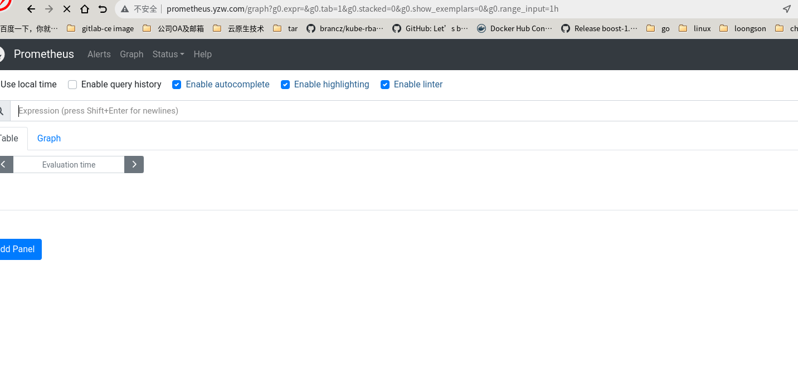
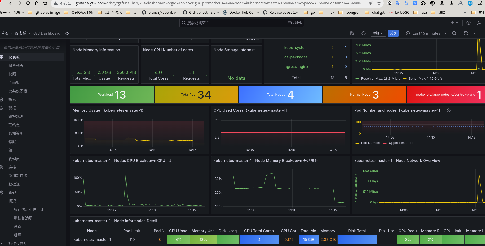

# prometheus\_grafana监控环境搭建

# 背景

&#x20;   对一些 需要复现的客户问题方便监控占用资源是否异常。

&#x20;   

# 复现

&#x20;   使用metallb 进行域名配置，ingress-nginx进行外部IP暴露，所有应用使用一个ip+多域名

&#x20;   

# 配置prometheus+grafana

&#x20;   下载配置文件进行配置

> helm pull prometheus-community/kube-prometheus-stack --untar

&#x20;   修改配置中：

主要修改了

1. 启动参数
2. 镜像版本
3. 镜像启动的worker指定


## 启动

1. install

   &#x20;   helm install yzw ./kube-prometheus-stack -n yzw --create-namespace
2. upgrade

   &#x20;    helm upgrade yzw kube-prometheus-stack -n yzw -f kube-prometheus-stack/values.yaml
3. uninstall

   &#x20;    helm uninstall yzw -n yzw

## nginx 域名代理

1. grafana配置文件

```
[root@k8s-master deploy-yaml]# cat ingress-grafana.yaml 
---
apiVersion: networking.k8s.io/v1
kind: Ingress
metadata:
  name: grafana-ingress
  namespace: yzw
  annotations:
    nginx.ingress.kubernetes.io/rewrite-target: /   # 可选，看路径转发需求
spec:
  ingressClassName: nginx   # 必须指定，匹配 ingress-nginx-controller
  rules:
    - host: grafana.yzw.com
      http:
        paths:
        - path: /
          pathType: Prefix
          backend:
            service:
              name: yzw-grafana
              port:
                number: 80
```

1. prometheus配置文件
   ```
   [root@k8s-master deploy-yaml]# cat ingress-prometheus.yaml 
   apiVersion: networking.k8s.io/v1
   kind: Ingress
   metadata:
     name: prometheus-ingress
     namespace: yzw
     annotations:
       nginx.ingress.kubernetes.io/rewrite-target: /   # 可选，根据路径转发需求
   spec:
     ingressClassName: nginx   # 必须指定，匹配 ingress-nginx-controller
     rules:
       - host: prometheus.yzw.com
         http:
           paths:
             - path: /
               pathType: Prefix
               backend:
                 service:
                   name: yzw-kube-prometheus-stack-prometheus
                   port:
                     number: 9090
   ```
2. 域名配置

   &#x20;   在dns域名服务器进行ip绑定或 在本机的hosts进行配置

   &#x20;   具体要绑定的ip 在master节点查询

```
[root@k8s-master deploy-yaml]# kubectl get svc -n ingress-nginx
NAME                                 TYPE           CLUSTER-IP       EXTERNAL-IP    PORT(S)                      AGE
ingress-nginx-controller             LoadBalancer   10.101.157.109   10.130.0.180   80:30917/TCP,443:32002/TCP   2d21h
ingress-nginx-controller-admission   ClusterIP      10.107.139.153   <none>         443/TCP                      2d21h
```

1. 访问





# PVC 配置

> 为了将监控数据持久化，需要配置本地的PVC
>

1. 在这里考虑将一台机器单独作为storage机器，使用nfs的方式进行挂载

```
mkdir /home/cloud-pv
dnf install -y nfs-utils
echo "/home/cloud-pv *(rw,sync,no_root_squash)" >> /etc/exports
 systemctl enable --now nfs-server
exportfs -a
#如果nfs端的机器端口未开放也无法被挂载，需要配置防火墙放行22端口
firewall-cmd --permanent --add-service=nfs
firewall-cmd --reload
systemctl start firewalld
```

1. 创建对grafana和promu的pv crd文件
   ```
   [root@k8s-master deploy-yaml]# cat pv.yaml 
   apiVersion: v1
   kind: PersistentVolume
   metadata:
     name: grafana-pv
   spec:
     capacity:
       storage: 10Gi          # 你需要的空间大小
     accessModes:
       - ReadWriteOnce
     persistentVolumeReclaimPolicy: Retain
     storageClassName: manual
     hostPath:
       path: /home/cloud-pv/grafana   # 节点本地目录
   ---
   apiVersion: v1
   kind: PersistentVolume
   metadata:
     name: prometheus-pv
   spec:
     capacity:
       storage: 20Gi          # Prometheus 通常需要更大
     accessModes:
       - ReadWriteOnce
     persistentVolumeReclaimPolicy: Retain
     storageClassName: manual
     hostPath:
       path: /home/cloud-pv/prometheus
   ```
   pv 配置成功查询：
   ```
   [root@k8s-master deploy-yaml]# kubectl get pv
   NAME            CAPACITY   ACCESS MODES   RECLAIM POLICY   STATUS      CLAIM   STORAGECLASS   VOLUMEATTRIBUTESCLASS   REASON   AGE
   grafana-pv      10Gi       RWO            Retain           Available           manual         <unset>                          61s
   prometheus-pv   20Gi       RWO            Retain           Available           manual         <unset>                          61s
   ```
2. 修改helm的values.yaml

   在`kube-prometheus-stack`的`values.yaml`里，找到 Grafana 和 Prometheus 的存储配置：

   **Grafana:**
   ```
   ```
   **Prometheus:**
   ```
   prometheus: prometheusSpec: storageSpec: volumeClaimTemplate: spec: storageClassName: manual accessModes: ["ReadWriteOnce"] resources: requests: storage: 20Gi
   ```
3. 查看grafana 密码

   kubectl --namespace yzw get secrets yzw-grafana -o jsonpath="{.data.admin-password}" | base64 -d ; echo
