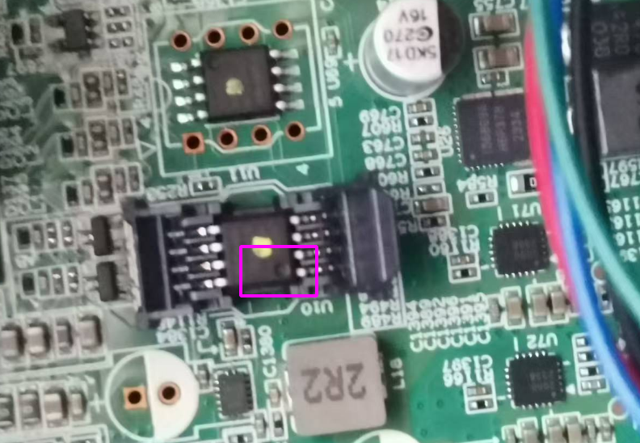

# 固件bios升降级

# 1. 背景

本文档是在安装debian abi2.0系统时需要对固件进行升级编写的，其中主要介绍了3种固件升级方法：

1）通过界面的方式更新固件

2）通过命令行的方式更新固件

3）使用软件烧写固件

# 2. 环境

&#x20;      使用机器：3A6000(CPU型号)-7A2000（桥片型号）

&#x20;      固件下载网址：\<u>http://10.40.25.14/Release/10\_BIOS/UDK2018-Release/LoongArch/3A6000-EVB/\</u> 

# 3. 界面更新固件

&#x20;     提前将需要使用的固件拷贝到U盘当中，这里以  UDK2018\_3A6000-7A2000\_Desktop\_EVB\_V4.0.05878.1-stable202411\_rel.fd 为例。

（1）启动系统，F2（可能根据硬件平台的差异该快捷键有差异）进入bios当中

（2）选择要更新的固件

&#x20;       a. 安全设置 --> 更新固件，然后选择U盘中已经拷贝好的固件：

&#x20;      选择后等待更新完成即可。

（3）确认固件是否更新

&#x20;       此时，可以看到固件即为我们刚刚烧写的固件。

# 4. 命令行烧写固件

a.  将需要烧写的固件拷贝到自己的U盘当中

b. F2进入bios --> 启动管理 --> UEFI shell

c. 进入UEFI后可通过输入"FSO:" 及 ”ls“ 命令，确认是否为自己的U盘，若不是可使用FS1, FS2来切换确认哪个是自己的U盘

d. 使用"spi -u <固件文件>" 命令来更新固件

e. 输入reset命令重启机器

# 5. 使用软件烧写固件

&#x20;      若在烧写固件的过程中，突然断电或因为其他原因突然中断，则会导致机器起不来，此时则需要使用专门的烧写软件进行烧写。

&#x20;      具体步骤如下：

&#x20;     1）先在机器上找到固件对应的硬件

&#x20;      **查找硬件的一个小技巧：由于固件烧写错后会导致系统起不来，此时只能通过软件的方式来烧写，所以固件的硬件为了方便插拔，带了一个壳子**。

&#x20;   注意下图中标价的圆圈的方向，防止后面回插错误：

&#x20;   2）烧写

&#x20;   a. 找到对应的芯片后，将其轻取下来，然后放到卡槽上，根据下面的标记放置芯片，不要放反：

b. 识别固件芯片

此时便可以在软件上进行操作：

选择对应的芯片型号（**这里的型号并不是固件的实际型号，只要型号的类型与机器上固件擦除和烧写的命令一致即可**）：

c. 加载要烧写的固件文件

d. 开始烧写

选择自动，此时可以看到烧写的过程：擦除 --> 编程 --> 校验

3）插回机箱，启动机器

烧写完成后，将芯片插回机箱，启动机器即可。

